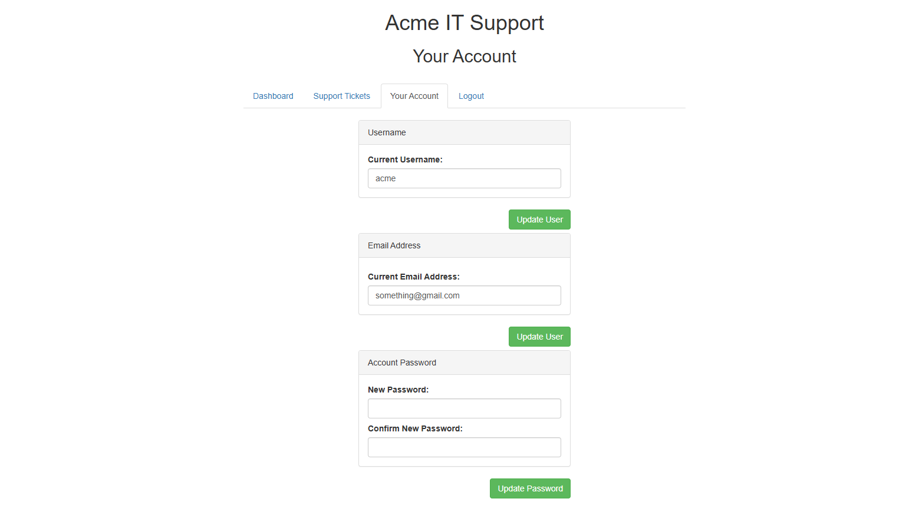
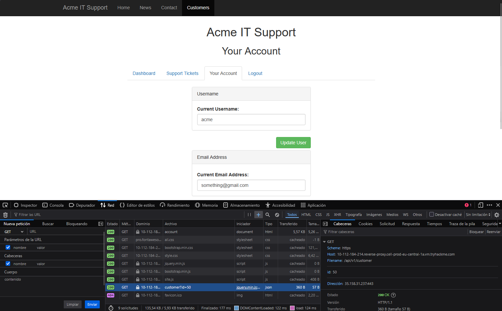
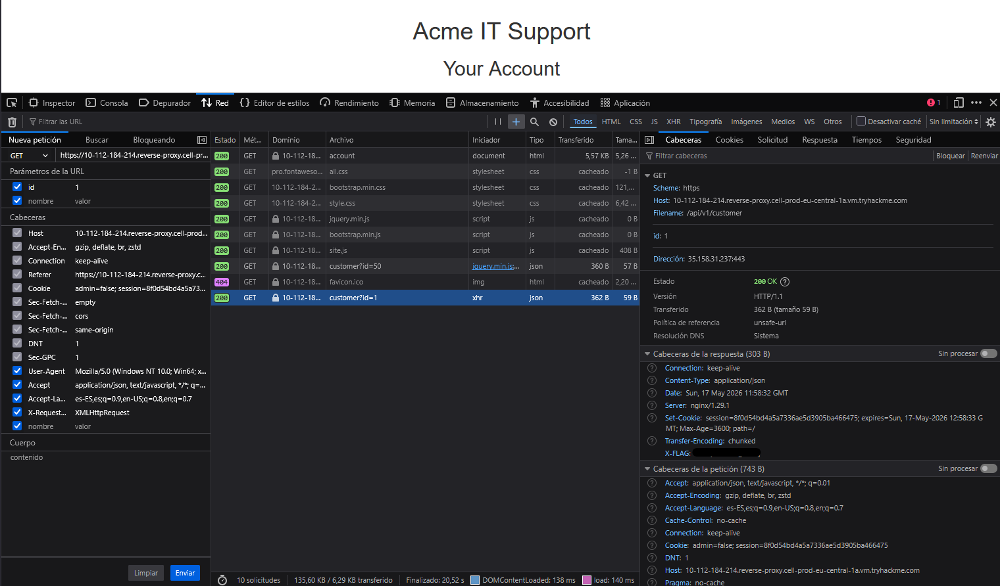
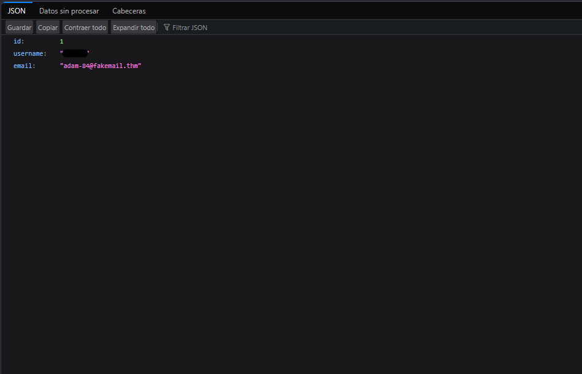

# IDOR (Insecure Direct Object Reference)

---

# 1. Introduction

IDOR (Insecure Direct Object Reference) is a type of access control vulnerability that occurs when an application exposes direct references to internal objects without properly validating whether the user is authorized to access them.

Applications commonly use identifiers to retrieve resources such as:

- User profiles
- Documents
- Orders
- API objects
- Files

If the application trusts user-controlled input without validating ownership server-side, attackers may manipulate object identifiers to access unauthorized resources.

---

## Authentication vs Authorization

Authentication verifies who the user is.

Authorization verifies what the user is allowed to access.

In many IDOR vulnerabilities, the application correctly authenticates the user but fails to validate whether the authenticated user is authorized to access the requested resource.

---

# 2. Identifying IDOR Vulnerabilities

IDOR vulnerabilities can appear in multiple forms depending on how applications reference internal objects and resources.

Common targets include:

- User profiles
- API endpoints
- Files and documents
- Orders and invoices
- Account settings
- Internal application objects

The most common indicator of an IDOR vulnerability is the presence of user-controlled identifiers that reference sensitive resources without proper authorization checks.

---

## 2.1 Predictable IDs

One of the most common forms of IDOR occurs when applications use sequential or predictable identifiers.

Example:

```http
/profile?user_id=1001
/profile?user_id=1002
```

If changing the identifier grants access to another user's data, the application is vulnerable to IDOR.

Predictable identifiers make enumeration attacks significantly easier because attackers can iterate through object references and collect sensitive information from multiple users.

---

## 2.2 Encoded IDs

Some applications encode identifiers before sending them to the client.

A common example is Base64 encoding.

Example:

```text
MTIz
```

Decoded value:

```text
123
```

Although encoding may visually obscure the identifier, it does not provide security.

Attackers can:

1. Decode the value
2. Modify the identifier
3. Re-encode the value
4. Resubmit the request

If the server does not validate ownership of the requested object, unauthorized access may still be possible.

---

## 2.3 Hashed IDs

Applications may also use hashed identifiers instead of raw integer values.

Example:

```text
202cb962ac59075b964b07152d234b70
```

This value corresponds to the MD5 hash of:

```text
123
```

Although hashes may appear secure, predictable hashing schemes can still expose applications to IDOR vulnerabilities.

Attackers may:

- Identify predictable patterns
- Use public hash databases
- Brute-force weak identifiers
- Correlate hashes with sequential values

Hashing identifiers alone does not replace proper authorization controls.

---

## 2.4 Unpredictable IDs

Some applications use random or non-sequential identifiers.

In these cases, a common testing approach is to create multiple accounts and compare requests between them.

If one user can access another user's resources by replacing object identifiers, the application may still be vulnerable to IDOR despite using unpredictable values.

This technique is particularly useful when identifiers cannot easily be enumerated.

---

## 2.5 Hidden Parameters and API Endpoints

IDOR vulnerabilities are not always visible directly in the browser address bar.

Modern web applications frequently retrieve data through:

- API requests
- AJAX calls
- JavaScript endpoints
- Hidden parameters

These requests can often be identified using browser developer tools and the Network tab.

Example:

```http
/api/v1/customer?id=123
```

Applications may unintentionally expose undocumented parameters or internal API functionality that can be manipulated by attackers.

This makes API inspection and parameter analysis important techniques during IDOR testing.

---

# 3. Practical Exploitation

## 3.1 Application Overview

The target application included a customer account section where authenticated users could view and modify account information such as:

- Username
- Email address
- Password

After creating an account and logging into the application, the "Your Account" page displayed the current user's information.



---

## 3.2 Identifying the API Request

Browser Developer Tools were used to inspect how the application retrieved account information.

By monitoring the Network tab and refreshing the page, an API request was identified:

```http
/api/v1/customer?id={user_id}
```

The endpoint returned user information in JSON format, including:

- User ID
- Username
- Email address

This indicated that the application relied on a user-controlled `id` parameter to retrieve account data.



---

## 3.3 Manipulating the ID Parameter

The `id` parameter was manually modified to test whether the application properly validated ownership of the requested resource.

Original request:

```http
/api/v1/customer?id=50
```

Modified request:

```http
/api/v1/customer?id=1
```

The server responded successfully and returned another user's account information.



---

## 3.4 Accessing Unauthorized Data

By modifying the identifier value, it was possible to access sensitive information belonging to other users.

The application failed to validate whether the authenticated user was authorized to access the requested resource.

This confirmed the presence of an Insecure Direct Object Reference (IDOR) vulnerability.



---

# 4. Why this works

## Authentication vs Authorization

The application correctly authenticated the user but failed to verify whether the authenticated user was authorized to access the requested resource.

Although the user was logged into the application, the backend did not validate ownership of the requested object before returning sensitive data.

---

## Missing Server-Side Validation

The API trusted the user-controlled `id` parameter without performing proper authorization checks on the server side.

As a result, attackers could manipulate object references and retrieve resources belonging to other users.

---

## Trusting User-Controlled Input

The application relied directly on user-supplied identifiers to retrieve sensitive account information.

Because object references were predictable and insufficiently validated, attackers could enumerate additional users and access unauthorized data.

---

# 5. Security Impact

IDOR vulnerabilities can expose sensitive application data and compromise user privacy.

Potential impacts include:

- Unauthorized access to user accounts
- Exposure of personal information
- Horizontal privilege escalation
- Large-scale user enumeration
- API abuse
- Data leakage

In real-world applications, IDOR vulnerabilities frequently affect APIs and internal backend services, making them particularly dangerous in modern web environments.

---

# 6. Remediation

## Server-Side Authorization Checks

Applications should validate on the server side whether the authenticated user is authorized to access the requested resource.

Authorization checks must never rely exclusively on client-side controls.

---

## Avoid Trusting User-Controlled Input

Applications should avoid directly exposing internal object references whenever possible.

User-controlled identifiers should never determine access permissions by themselves.

---

## Use Indirect Object References

Indirect references such as UUIDs can reduce predictability and make enumeration attacks more difficult.

However, UUIDs do not replace proper authorization checks.

---

## Implement Access Control Validation

Access control should be enforced consistently across:

- API endpoints
- AJAX requests
- Internal services
- Backend functionality

---

## Principle of Least Privilege

Applications and backend services should follow the principle of least privilege to reduce the impact of authorization failures.

---

# 7. Final Notes

This room demonstrated how insecure object references can expose sensitive information when authorization controls are improperly implemented.

Although IDOR vulnerabilities may appear simple, they remain one of the most common and impactful access control issues in modern web applications and APIs.

---
