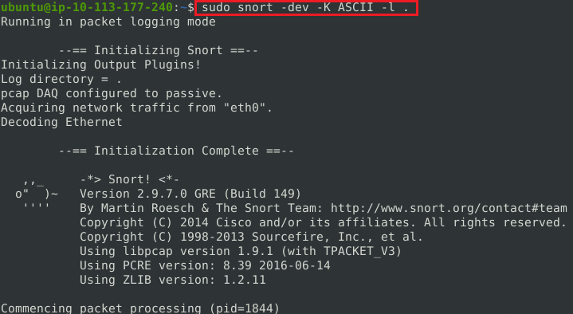
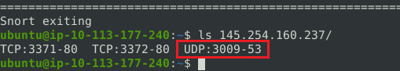
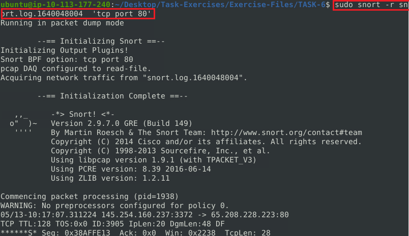
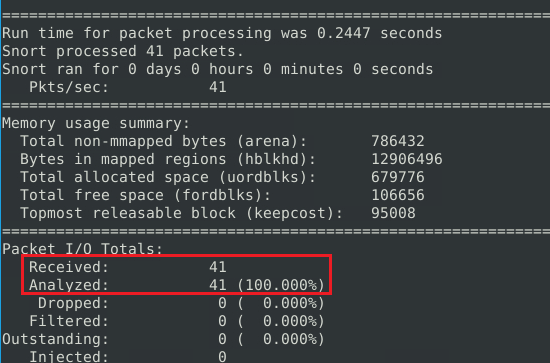
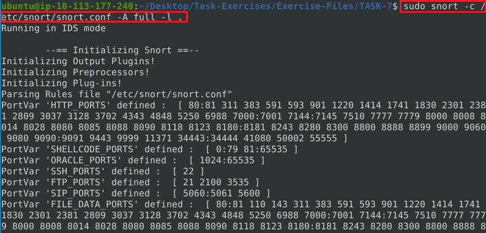
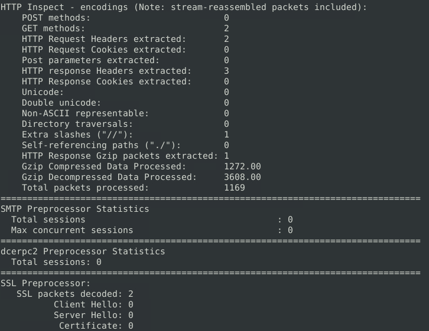
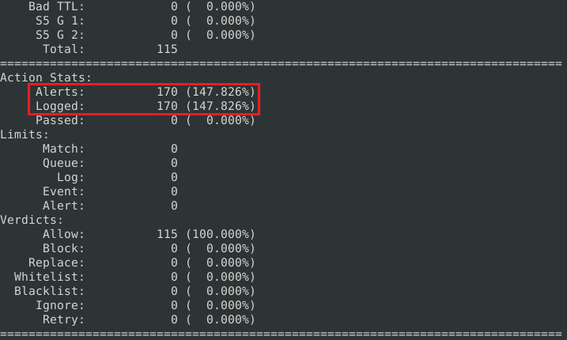
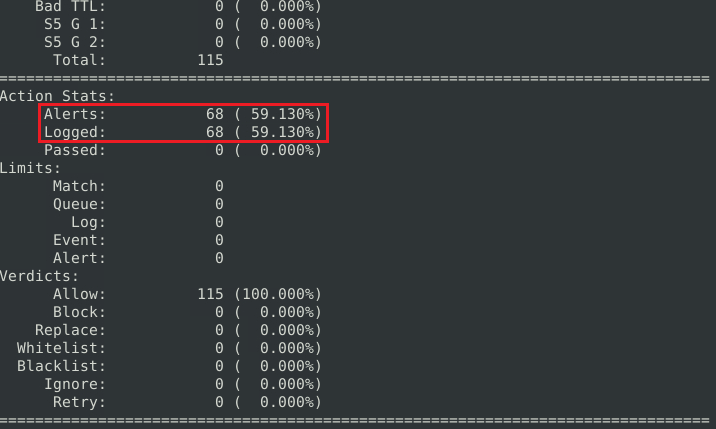
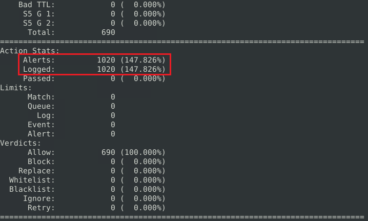

# Snort: Network Detection and Traffic Analysis

A technical analysis of network traffic inspection, IDS/IPS detection, packet logging, PCAP investigation and rule-based threat detection using Snort.

---

# 1. Scenario Overview

Snort is an open-source, rule-based network security tool capable of operating as both an Intrusion Detection System (IDS) and an Intrusion Prevention System (IPS).

The analysis focuses on the inspection of network traffic, packet logging, offline PCAP investigation, IDS/IPS alert generation and the development of custom detection rules. These capabilities provide 
visibility into network activity and allow specific traffic patterns to be identified through configurable detection logic.

The investigation covers both real-time traffic inspection and retrospective analysis of captured network traffic. Different Snort configurations and rule sets are evaluated to demonstrate how detection 
results can vary depending on the applied configuration.

The overall analysis is focused on network-based threat detection and the application of Snort capabilities within a Security Operations Center (SOC) environment.

---

# 2. Investigation Objectives

The investigation aims to evaluate the use of Snort for network-based security monitoring and rule-driven threat detection.

The primary objectives are:

- Analyse network traffic and inspect packet-level information.
- Configure and evaluate packet logging capabilities.
- Detect suspicious network activity using IDS/IPS rules.
- Analyse captured network traffic through PCAP files.
- Develop and test custom Snort detection rules.
- Evaluate how different configurations and rule sets influence detection results.
- Assess the relevance of Snort capabilities within a SOC monitoring and investigation workflow.

---

# 3. Evidence Analysis

## 3.1. Network Traffic Inspection

Snort provides several operating parameters for inspecting network traffic at different levels of detail. Sniffer mode can be used to observe packets directly from a network interface, 
while additional parameters control the amount and type of information displayed.

The main inspection parameters are:

| Parameter | Function |
|---|---|
| `-v` | Displays TCP/IP packet information |
| `-d` | Displays packet payload data |
| `-e` | Displays link-layer information |
| `-X` | Displays packet data in hexadecimal and ASCII format |
| `-i` | Specifies the network interface |

These options allow network traffic to be examined from different perspectives, ranging from basic packet metadata to payload and link-layer information.

The combination of these parameters provides the initial visibility required for packet-level network analysis and supports subsequent investigation and detection activities.

---

## 3.2. Packet Logging and Analysis

Snort can operate as a packet logger, allowing captured network traffic to be stored for subsequent investigation. Packet logging can be performed in binary format or as human-readable ASCII output, 
depending on the analysis requirements.

ASCII logging was enabled using the following configuration:

    sudo snort -dev -K ASCII -l .

The `-l` parameter specifies the logging directory, while `-K ASCII` configures Snort to generate human-readable log files. The `-d`, `-e` and `-v` parameters provide additional packet and protocol information 
during the capture.

The generated logs can subsequently be reviewed using Snort's packet-reading functionality:

    snort -r snort.log.1640048004 -n 10

The `-r` parameter reads a previously generated Snort log, while `-n 10` limits the analysis to the first ten packets. This allows individual packet attributes to be examined without capturing the traffic again.

The initial packet analysis identified the source port associated with DNS traffic as `3009`.

Further analysis of the captured packets identified the following network attributes:

| Network Attribute | Observed Value |
|---|---|
| Source port associated with DNS traffic | `3009` |
| IP identification value | `49313` |
| HTTP Referer | `http://www.ethereal.com/development.html` |
| TCP Acknowledgement | `0x38AFFFF3` |

HTTP traffic was subsequently isolated to determine the number of packets associated with TCP port 80. The packet analysis also identified **41 HTTP packets** within the captured traffic.

The packet logging and replay capabilities provide a practical mechanism for both real-time traffic collection and retrospective network investigation. Captured traffic can be revisited to extract protocol-level indicators and validate observations without requiring the original network activity to be reproduced.

---

## 3.3. IDS/IPS Detection

Snort can operate as both an Intrusion Detection System (IDS) and an Intrusion Prevention System (IPS), depending on how traffic is processed and how detection rules are configured.

In IDS mode, matching traffic generates alerts while the traffic itself continues to its destination. In IPS mode, Snort can operate inline and take enforcement actions such as dropping or rejecting traffic 
that matches configured rules.

The main configuration can be validated before starting an analysis:

    sudo snort -c /etc/snort/snort.conf -T

The `-c` parameter specifies the Snort configuration file, while `-T` validates the configuration without processing live traffic.

Snort provides several alert output modes depending on the level of detail required:

| Alert Mode | Description |
|---|---|
| `full` | Generates detailed alert information |
| `fast` | Generates concise alert information |
| `console` | Displays alerts directly in the console |
| `cmg` | Displays alert information together with packet payload data |
| `none` | Disables alert generation |

For detailed traffic analysis, the `full` alert mode can be combined with a specified logging directory:

    sudo snort -c /etc/snort/snort.conf -A full -l .

The resulting analysis identified **2 HTTP GET methods** within the observed traffic.

The detection demonstrates how Snort can identify specific application-layer traffic patterns through configured rules and generate corresponding security alerts.

In an inline IPS deployment, Snort can additionally process traffic between network interfaces and apply enforcement actions to matching packets. This extends the detection capability from 
passive monitoring to active traffic control.

The distinction between IDS and IPS operation is therefore primarily based on the role Snort performs within the traffic path: IDS focuses on detection and alerting, while IPS can additionally enforce configured prevention actions.

---

## 3.4. PCAP Investigation

Snort can analyse previously captured network traffic stored in PCAP files, enabling retrospective investigation without requiring access to the original network session. This capability can be used to identify 
network activity, generate alerts and evaluate captured traffic against different detection configurations.

The `mx-1.pcap` capture was first analysed using the primary Snort configuration:

    sudo snort -c /etc/snort/snort.conf -A full -l . -r mx-1.pcap

The analysis generated **170 alerts**. The associated statistics also reported **18 TCP segments queued** and **3 HTTP response headers extracted**.

The same PCAP was subsequently analysed using an alternative configuration:

    sudo snort -c /etc/snort/snortv2.conf -A full -l . -r mx-1.pcap

This analysis generated **68 alerts**.

The difference between the two results demonstrates that Snort detection output is directly influenced by the configuration and ruleset applied to the same network traffic. This is an important consideration when interpreting alert volumes during security investigations.

A second capture, `mx-2.pcap`, was analysed using the primary configuration:

    sudo snort -c /etc/snort/snort.conf -A full -l . -r mx-2.pcap

The analysis generated **340 alerts** and identified **82 TCP packets**.

Multiple PCAP files were then processed together:

    sudo snort -c /etc/snort/snort.conf -A full -l . --pcap-list="mx-2.pcap mx-3.pcap"

The combined analysis generated **1020 alerts**.

The results demonstrate the usefulness of offline PCAP analysis for retrospective threat detection. Applying consistent configurations across multiple captures allows network activity to be investigated at scale, while comparing configurations can help assess the effectiveness and coverage of different detection rulesets.

---

## 3.5. Detection Rule Analysis

---

## 3.6. Detection Logic and Configuration

---
