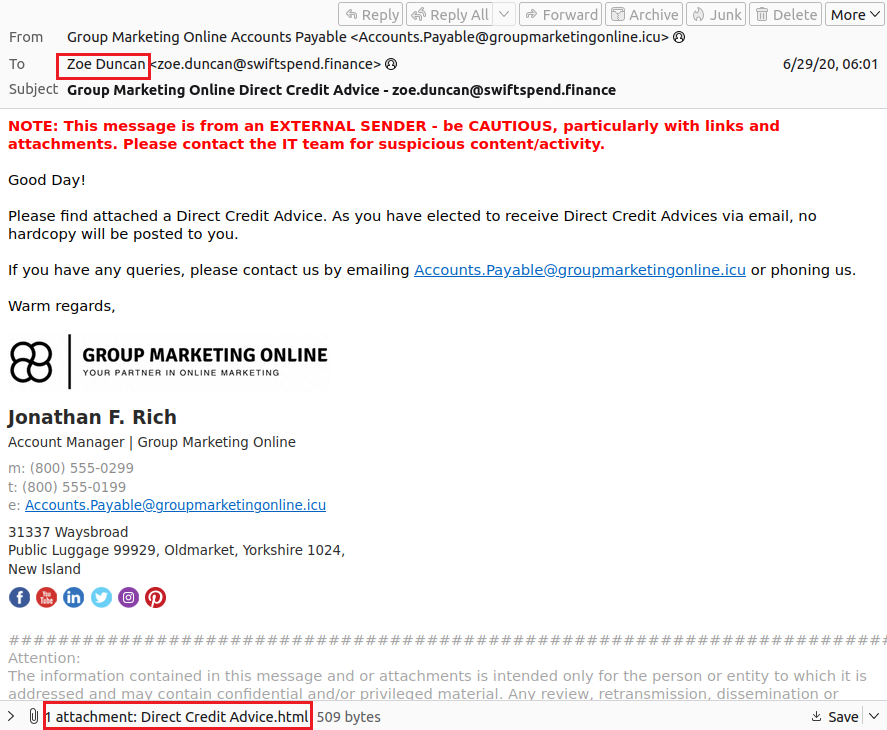
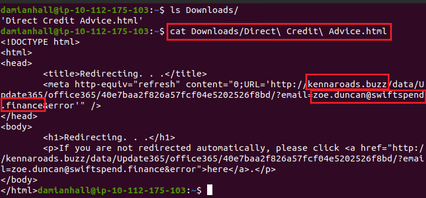
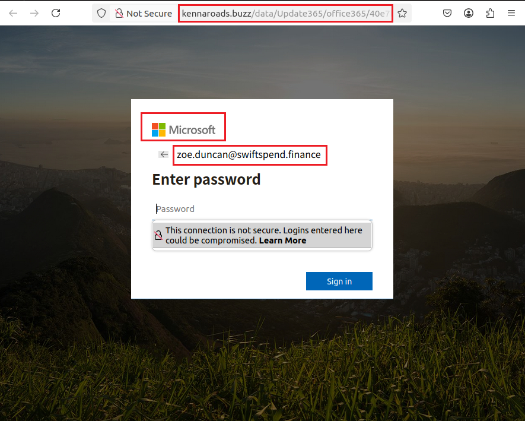
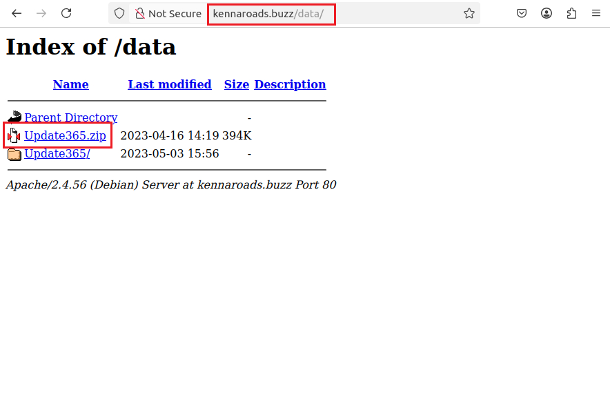
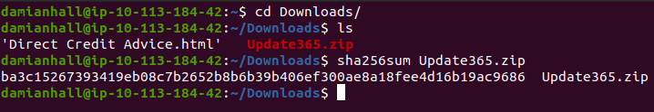
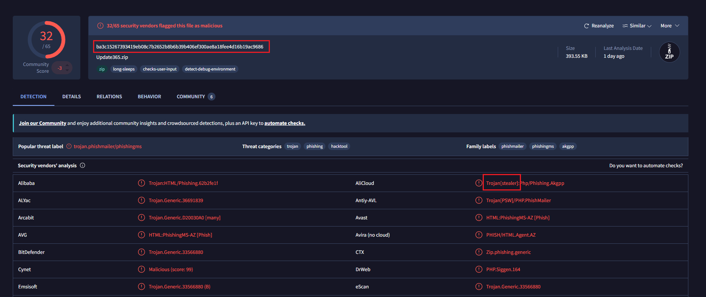
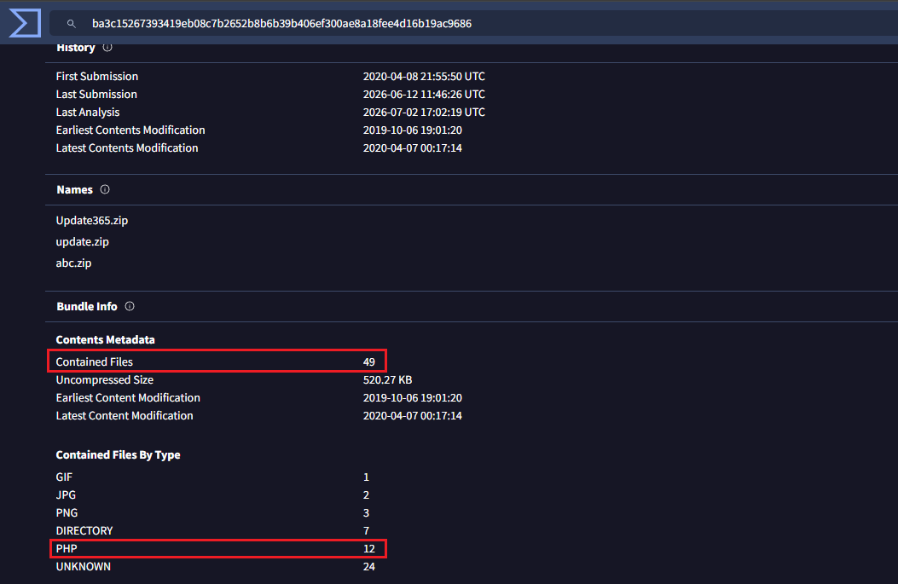
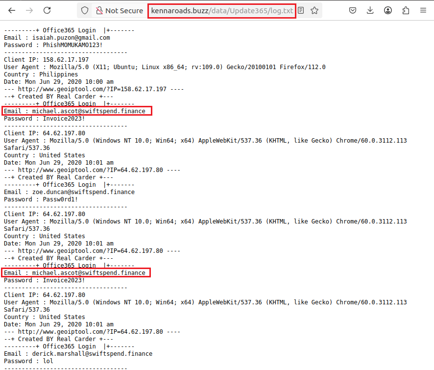
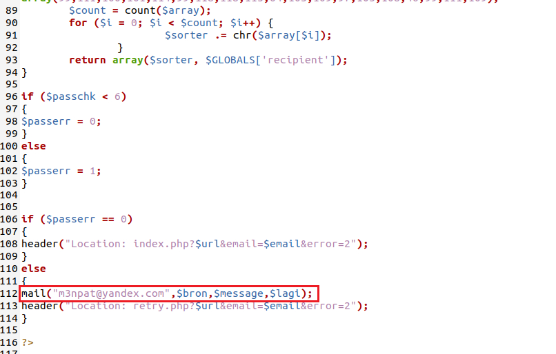

# Snapped Phish-ing Line

## 1. Scenario Overview

Multiple employees at **SwiftSpend Financial** reported receiving a suspicious email containing characteristics commonly associated with phishing attacks. While some users identified the message as suspicious, others interacted with it and submitted their credentials, subsequently losing access to their accounts.

Given the potential for credential compromise and unauthorized access, the incident was escalated to the Security Operations Center (SOC) for investigation.

The objective of this investigation was to analyze the phishing campaign, determine the scope of the compromise, identify relevant indicators of compromise (IOCs) and understand the techniques used by the attacker to deceive users.

---

## 2. Investigation Objectives

- Analyze the phishing email and identify suspicious characteristics.
- Investigate the infrastructure used by the attacker.
- Identify indicators of compromise (IOCs).
- Assess the extent of the credential compromise.
- Reconstruct the attack workflow.
- Provide recommendations to reduce the risk of similar attacks.

---

## 3. Evidence Analysis

### 3.1. Email Identification

The investigation began by reviewing the collection of suspicious emails provided as part of the incident.

Among the reported messages, one email with the subject **"Quote for Services Rendered"** was identified as a phishing email received by **William McClean**.

The message was then examined to identify the sender and collect the first indicators of compromise.

| Artifact | Value |
|-----------|-------|
| Recipient | William McClean |
| Sender Email | Accounts.Payable@groupmarketingonline.icu |

The sender's domain immediately raised suspicion due to the uncommon **.icu** top-level domain and the use of a generic finance-related mailbox, a naming convention frequently observed in phishing campaigns.


---

### 3.2. Embedded URL Analysis

To further investigate the phishing campaign, the attachment contained in the email addressed to **Zoe Duncan** was extracted and inspected.

After downloading the HTML attachment, its contents were examined directly from the command line.

```bash
cat Downloads/Direct\ Credit\ Advice.html
```

Inspection of the HTML source revealed an embedded URL designed to redirect victims to an external website.

```text
http://kennaroads.buzz/data/Update365/office365/40e7baa2f826a57fcf04e5202526f8bd/?email=zoe.duncan@swiftspend.finance&error
```

| Artifact | Value |
|-----------|-------|
| Root Domain | kennaroads.buzz |

The embedded URL also contained the victim's email address as a query parameter, indicating that the phishing page was personalized for each recipient.






---

### 3.3. Credential Harvesting Page Analysis

The extracted HTML attachment was opened inside a controlled browser environment.

The attachment redirected the browser to a fraudulent **Microsoft 365** login page.

| Artifact | Value |
|-----------|-------|
| Impersonated Service | Microsoft 365 |
| Attack Technique | Credential Harvesting |

The phishing page automatically populated the victim's email address, increasing its legitimacy and reducing user interaction before credential submission.




---

### 3.4. Infrastructure Reconnaissance

The phishing infrastructure was further investigated by manually browsing the attacker's server.

Directory indexing was enabled, exposing several hosted resources.

Among them, the archive **Update365.zip** was identified.

| Artifact | Value |
|-----------|-------|
| Exposed Archive | Update365.zip |

The exposed directory listing represents a server misconfiguration that unintentionally revealed additional evidence related to the phishing campaign.



---

### 3.5. Phishing Kit Acquisition

The exposed archive was downloaded and its integrity verified.

```bash
sha256sum Update365.zip
```

| Artifact | Value |
|-----------|-------|
| Archive | Update365.zip |
| SHA256 | ba3c15267393419eb08c7b2652b8b6b39b406ef300ae8a18fee4d16b19ac9686 |

The generated hash was later used for threat intelligence enrichment.



---

### 3.6. Threat Intelligence Enrichment

The SHA256 hash was investigated using VirusTotal.

The archive was classified not only as phishing-related but also under the **Trojan** threat category.

| Artifact | Value |
|-----------|-------|
| Platform | VirusTotal |
| Additional Threat Category | Trojan |

Threat intelligence enrichment helps analysts understand how an artifact has previously been classified and provides additional context during investigations.



---

### 3.7. Phishing Kit Characterization

VirusTotal metadata was also reviewed to understand the composition of the phishing kit.

The archive contained **49 files**.

| Artifact | Value |
|-----------|-------|
| Contained Files | 49 |
| Uncompressed Size | 520.27 KB |

The archive included:

- 12 PHP files
- 7 directories
- 3 PNG images
- 2 JPG images
- 1 GIF image
- 24 unknown files

The presence of numerous PHP scripts suggests that the archive contained the complete backend required to operate the phishing website.



---

### 3.8. Credential Exposure Assessment

The phishing infrastructure was further inspected to determine whether stolen credentials had been exposed.

A publicly accessible log file was discovered.

```text
/data/Update365/log.txt
```

Analysis of the log entries revealed that **michael.ascot@swiftspend.finance** had submitted credentials multiple times.

| Artifact | Value |
|-----------|-------|
| Log File | /data/Update365/log.txt |
| Compromised User | michael.ascot@swiftspend.finance |

This confirms that the phishing campaign successfully harvested user credentials.



---

### 3.9. Phishing Kit Analysis

The recovered archive was extracted and examined locally.

Inspection of the **submit.php** script revealed the email address configured to receive stolen credentials.

| Artifact | Value |
|-----------|-------|
| PHP Script | submit.php |
| Credential Collection Email | m3npat@yandex.com |

This finding confirms the complete credential harvesting workflow and provides valuable threat intelligence for future investigations.



---

## 4. Indicators of Compromise (IOCs)

| Type | Value |
|------|-------|
| Sender Email | Accounts.Payable@groupmarketingonline.icu |
| Root Domain | kennaroads.buzz |
| Archive | Update365.zip |
| SHA256 | ba3c15267393419eb08c7b2652b8b6b39b406ef300ae8a18fee4d16b19ac9686 |
| Credential Collection Email | m3npat@yandex.com |
| Compromised User | michael.ascot@swiftspend.finance |

---

## 5. Findings

The investigation confirmed that the reported emails were part of a credential harvesting campaign targeting Microsoft 365 users.

Key findings include:

- Phishing emails impersonating financial communications.
- Personalized phishing URLs containing victim email addresses.
- A fraudulent Microsoft 365 login page.
- Exposed phishing infrastructure with directory indexing enabled.
- A complete phishing kit available for download.
- Confirmed credential harvesting through exposed log files.
- Server-side scripts configured to exfiltrate credentials to the attacker's mailbox.

---

## 6. Mitigation Recommendations

- Block all identified IOCs.
- Disable access to identified phishing domains through web filtering.
- Reset passwords for affected users.
- Enforce Multi-Factor Authentication (MFA).
- Educate users to identify phishing attempts.
- Monitor for authentication attempts using compromised accounts.
- Review email security policies and attachment filtering.

---

## 7. Lessons Learned

This investigation demonstrated how a phishing campaign can be reconstructed by combining email analysis, infrastructure investigation, threat intelligence and source code inspection.

Key skills practiced during this exercise include:

- Email Analysis
- URL Analysis
- Threat Intelligence Enrichment
- Infrastructure Reconnaissance
- Credential Harvesting Investigation
- IOC Extraction
- Basic PHP Analysis
- Incident Investigation

---

## 8. Tools Used

- Thunderbird
- Linux Terminal
- VirusTotal
- Web Browser
