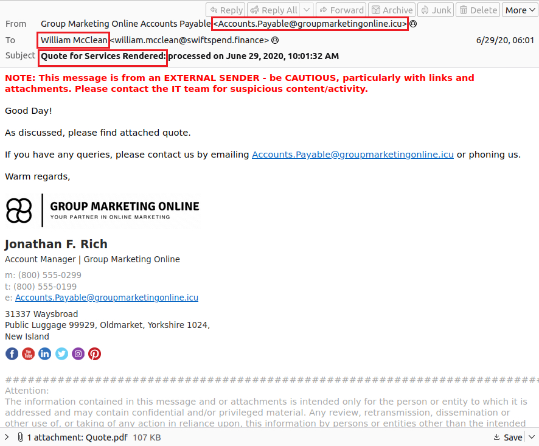

# Snapped Phish-ing Line

## Scenario Overview

Multiple employees at **SwiftSpend Financial** reported receiving a suspicious email containing characteristics commonly associated with phishing attacks. While some users identified the message as suspicious, others interacted with it and submitted their credentials, subsequently losing access to their accounts.

Given the potential for credential compromise and unauthorized access, the incident was escalated to the Security Operations Center (SOC) for investigation.

The objective of this investigation was to analyze the phishing campaign, determine the scope of the compromise, identify relevant indicators of compromise (IOCs) and understand the techniques used by the attacker to deceive users.

---

## Investigation Objectives

- Analyze the phishing email and identify suspicious characteristics.
- Investigate the infrastructure used by the attacker.
- Identify indicators of compromise (IOCs).
- Assess the extent of the credential compromise.
- Reconstruct the attack workflow.
- Provide recommendations to reduce the risk of similar attacks.

---

# Evidence Analysis

## Email Identification

The investigation began by reviewing the collection of suspicious emails provided as part of the incident.

Among the reported messages, one email with the subject **"Quote for Services Rendered"** was identified as a phishing email received by **William McClean**.

The message was then examined to identify the sender and collect the first indicators of compromise.

| Artifact | Value |
|-----------|-------|
| Recipient | William McClean |
| Sender Email | Accounts.Payable@groupmarketingonline.icu |

The sender's domain immediately raised suspicion due to the uncommon **.icu** top-level domain and the use of a generic finance-related mailbox, a naming convention frequently observed in phishing campaigns.



---

## Embedded URL Analysis

To further investigate the phishing campaign, the attachment contained in the email addressed to **Zoe Duncan** was extracted and inspected.

After downloading the HTML attachment, its contents were examined directly from the command line.

```bash
cat Downloads/Direct\ Credit\ Advice.html
```

Inspection of the HTML source revealed an embedded URL designed to redirect victims to an external website.

```text
http://kennaroads.buzz/data/Update365/office365/40e7baa2f826a57fcf04e5202526f8bd/?email=zoe.duncan@swiftspend.finance&error
```

| Artifact | Value |
|-----------|-------|
| Root Domain | kennaroads.buzz |

The embedded URL also contained the victim's email address as a query parameter, indicating that the phishing page was personalized for each recipient.
