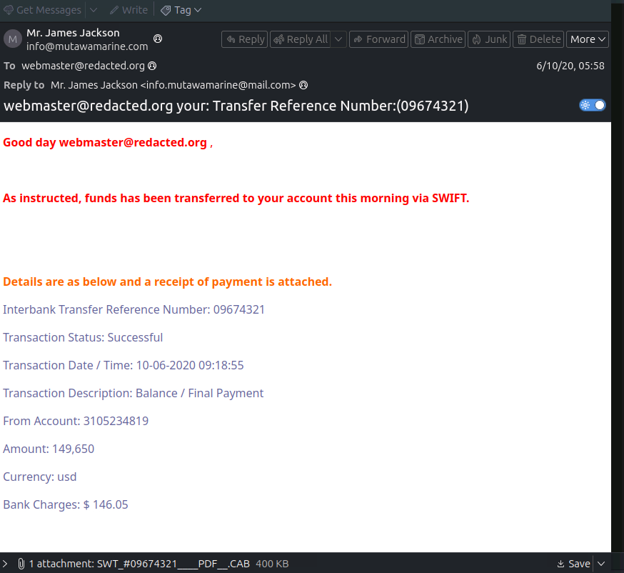
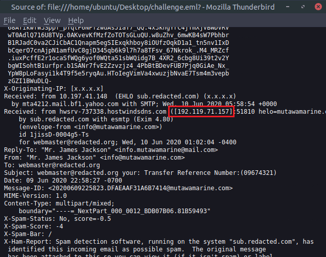
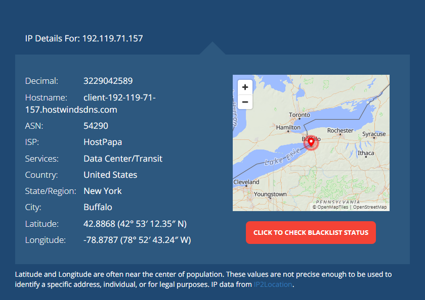
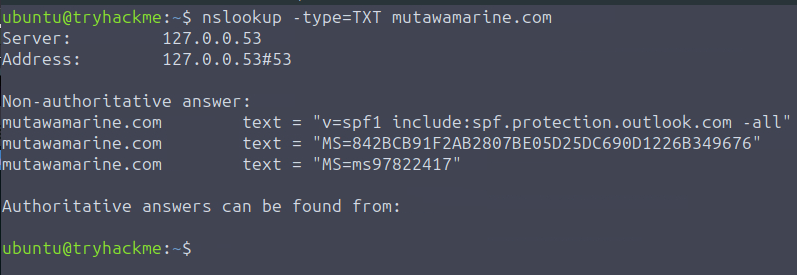
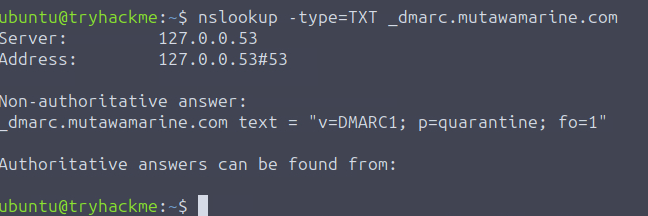
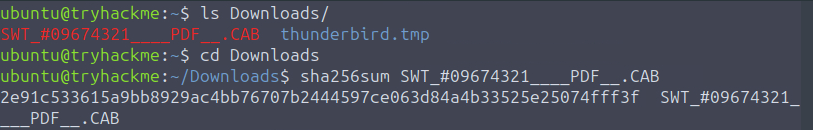
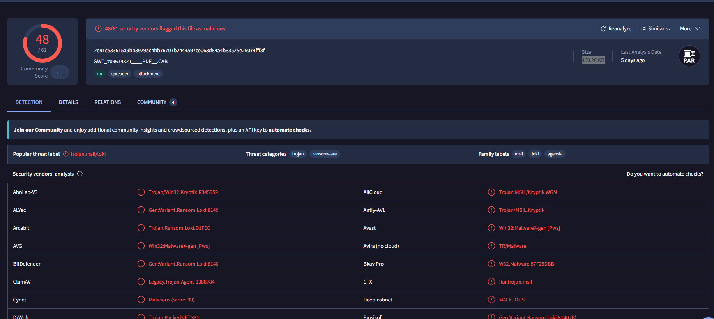

# The Greenholt Phish

# 1. Scenario Overview

A sales executive at Greenholt PLC reported a suspicious email allegedly received from a known customer. The employee noticed several unusual characteristics, including a generic greeting, an unexpected request involving a financial transaction and an unsolicited attachment. According to the recipient, these elements did not match the customer's normal communication patterns.

Due to the potential risk of phishing or business email compromise (BEC), the email was escalated to the Security Operations Center (SOC) for further analysis.

The objective of this investigation was to determine whether the email was legitimate or malicious by examining its contents, verifying its origin and identifying any indicators of compromise (IOCs).

---

# 2. Investigation Objectives

- Analyze the email and extract relevant artifacts.
- Verify the authenticity and origin of the message.
- Identify indicators commonly associated with phishing activity.
- Assess the attachment and any suspicious content.
- Determine the overall risk posed by the email.

---

# 3. Investigation Methodology

The investigation was performed by analyzing the provided EML file in a controlled environment. Thunderbird Mail was used to inspect both the email content and its underlying metadata.

The analysis focused on:

- Sender and recipient information
- Email headers and routing details
- Email authentication mechanisms (SPF and DMARC)
- Reply-To and Return-Path addresses
- Attachment analysis
- Threat intelligence enrichment

The objective was to determine whether the email originated from a legitimate sender or was part of a phishing attempt.

---

# 4. Evidence Analysis

## 4.1. Email Overview

Initial inspection of the email revealed the following information:

| Artifact | Value |
|-----------|---------|
| Subject | Transfer Reference Number: 09674321 |
| Display Name | Mr. James Jackson |
| Sender Address | info@mutawamarine.com |
| Reply-To Address | info.mutawamarine@mail.com |

---


---

## 4.2. Sender Analysis

The sender introduced himself as **Mr. James Jackson** using the email address:

```text
info@mutawamarine.com
```

At first glance, the sender information appeared legitimate and consistent with a business communication.

However, further inspection of the message headers revealed inconsistencies that warranted additional investigation.

---

## 4.3. Reply-To Analysis

The email specified the following Reply-To address:

```text
info.mutawamarine@mail.com
```

This address differs from the sender's original domain:

```text
mutawamarine.com
```

The use of a different Reply-To address is a common phishing technique. Attackers often impersonate legitimate organizations while redirecting responses to an email account under their control.

This discrepancy represents a strong phishing indicator.

---

## 4.4. Email Routing Analysis

To identify the true origin of the message, the email headers were examined, focusing on the `Received` fields.

The earliest routing entry revealed the originating IP address:

| Artifact | Value |
|-----------|---------|
| Originating IP | 192.119.71.157 |

Email routing information is useful because it can reveal the infrastructure responsible for sending the message, regardless of the sender address displayed to the recipient.



---

## 4.5. Infrastructure Investigation

The originating IP address was investigated using publicly available IP intelligence sources.

| Artifact | Value |
|-----------|---------|
| IP Address | 192.119.71.157 |
| Hosting Provider | HostPapa |

The infrastructure was identified as belonging to HostPapa.

While the use of a hosting provider is not inherently malicious, phishing campaigns frequently leverage third-party hosting services to distribute fraudulent emails and obscure attribution.



---

## 4.6. SPF Analysis

The Return-Path domain was investigated to determine whether its email infrastructure was authorized to send messages on behalf of the domain.

A DNS lookup was performed to retrieve the SPF record associated with the domain.

```text
v=spf1 include:spf.protection.outlook.com -all
```

SPF (Sender Policy Framework) helps prevent sender spoofing by defining which mail servers are authorized to send email for a domain.



---

## 4.7. DMARC Analysis

A DMARC lookup was performed against the Return-Path domain to evaluate its email authentication policy.

```text
v=DMARC1; p=quarantine; fo=1
```

DMARC (Domain-based Message Authentication, Reporting and Conformance) enables domain owners to define how receiving mail servers should handle messages that fail SPF or DKIM validation.

The presence and configuration of a DMARC policy can provide additional context when assessing the legitimacy of an email.



---

## 4.8. Attachment Analysis

The attachment was extracted and analyzed as part of the investigation.

A SHA256 hash was generated to uniquely identify the file and support threat intelligence enrichment.



The hash was submitted to VirusTotal, where additional metadata about the file was obtained.

| Artifact | Value |
|-----------|---------|
| SHA256 | 2e91c533615a9bb8929ac4bb76707b2444597ce063d84a4b33525e25074fff3f |
| File Type | ZIP Archive |
| File Size | 400.26 KB |

Compressed attachments are commonly used in phishing campaigns to bypass email filtering controls and conceal potentially malicious payloads.



---
