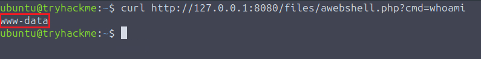
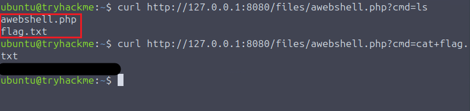
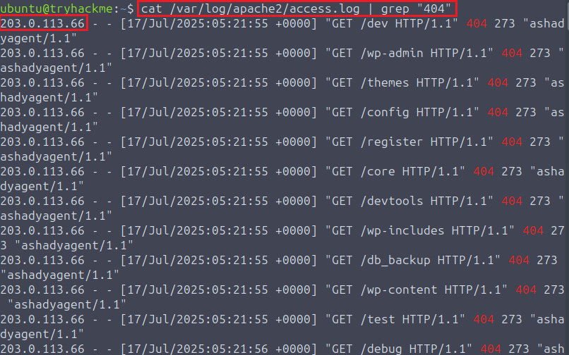
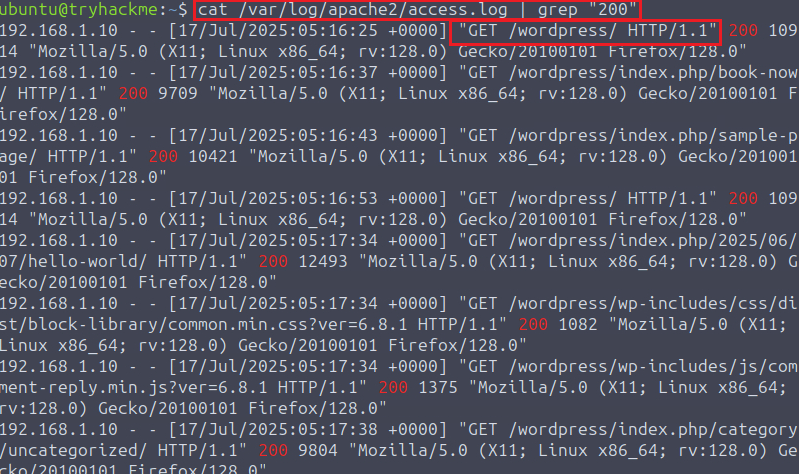
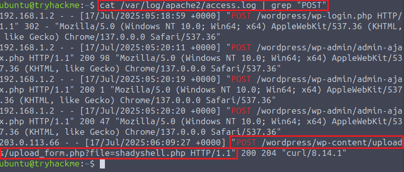
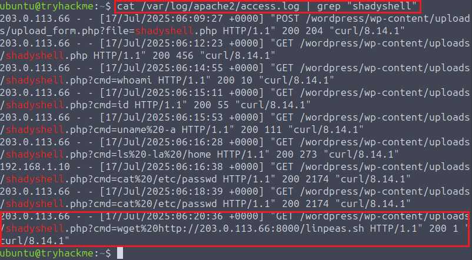
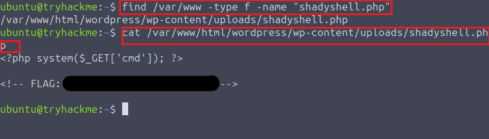

# Detecting Web Shells

---

# 1. Scenario Overview

Web shells represent a significant security risk because they can transform a compromised web application into a direct interface for operating system command execution. A web shell is typically a malicious 
server-side script that has been placed on a web server through an exploited vulnerability, insecure file upload functionality or another form of unauthorised access. Once successfully deployed, the attacker 
can interact with the compromised host by sending commands through HTTP or HTTPS requests.

The impact of a web shell extends beyond the initial compromise. Depending on the privileges of the web server process, an attacker may use the shell to perform system reconnaissance, access sensitive files, download additional tools, search for credentials, attempt privilege escalation and establish further persistence. This makes web shell activity an important detection opportunity for security monitoring teams, as the initial 
web application compromise can quickly develop into broader host-level activity.

Detecting this type of compromise can be challenging because web shells are often placed inside legitimate application directories or locations intended for user-uploaded content. A malicious PHP file within a WordPress upload directory for example, may initially appear to be an ordinary application resource. However, when its presence is correlated with unusual HTTP requests, suspicious upload activit, and subsequent command execution, the same file can become strong evidence of compromise.

This investigation examines a suspected web shell compromise affecting a WordPress application. The analysis begins with Apache access logs to reconstruct the sequence of requests made against the application and identify the source of the suspicious activity. The investigation then follows the attack through resource discovery and file upload activity before examining subsequent interactions with the deployed web shell.

The investigation also extends beyond web server telemetry to the underlying file system. By locating the malicious script and analysing its contents, the investigation establishes a direct connection between the observed HTTP activity and the server-side file responsible for command execution. This correlation provides a more complete understanding of the compromise than analysing individual log entries in isolation.

The overall objective is to reconstruct the attack from a SOC analyst's perspective, identify the relevant indicators of compromise, determine the extent of the observed activity and extract defensive lessons that can be applied to the detection and prevention of similar web shell attacks.

---

# 2. Objectives

The investigation aims to determine how the suspected web shell compromise occurred, how the attacker interacted with the affected WordPress application and what activity followed the initial compromise. The analysis is focused on reconstructing the attack sequence from the available evidence and establishing a clear relationship between web application activity and actions performed on the underlying server.

The first objective is to identify the source and nature of the suspicious activity recorded in the Apache access logs. This includes determining the originating IP address, identifying the resources targeted by the attacker and distinguishing unsuccessful reconnaissance attempts from requests that resulted in successful access to the application.

The investigation then seeks to determine how the web shell was introduced into the environment. Particular attention is given to file upload activity and the application endpoint associated with the deployment of the malicious script. Establishing this part of the attack chain is important for understanding how the attacker moved from web application reconnaissance to server-side code execution.

A further objective is to establish what actions were performed after the web shell became accessible. The investigation examines requests made to the malicious file, the commands executed through it and any additional files or tools downloaded during the observed activity. This provides insight into the attacker's immediate objectives and helps determine whether the compromise progressed beyond the initial web shell deployment.

Finally, the investigation aims to locate the malicious file on the host and analyse its contents to confirm its role in the compromise. By correlating Apache access logs with file system evidence, the analysis seeks to produce a coherent timeline of the incident and identify reliable indicators that could support future detection, threat hunting and incident response activities.

---

# 3. Evidence Analysis

The investigation was conducted by correlating web shell activity, Apache access logs and host-level file system evidence to reconstruct the observed compromise.

The analysis begins by examining the deployed web shell and demonstrating its ability to execute commands on the underlying server. This establishes the security impact of the malicious file before tracing the activity backwards through the Apache logs to identify the source of the attack and determine how the web shell was introduced.

The investigation then follows the activity chronologically, from initial reconnaissance and application discovery through web shell deployment, command execution and post-compromise reconnaissance. Finally, file system analysis is used to locate the malicious script and examine its contents.

This approach allows the individual pieces of evidence to be correlated into a single attack sequence rather than analysed as isolated events.

--- 

## 3.1. Web Shell Command Execution

---

### 3.1.1. Initial Access to the Web Shell

The first stage of the investigation involved interacting with the deployed web shell to establish whether the server-side script provided operating system command execution.

The `whoami` command was used as an initial test to determine the security context under which commands submitted through the web shell were executed. The command returned `www-data`, indicating that the web shell was operating within the security context of the web server process.

The result demonstrated that the web shell was not simply serving static content. It was capable of passing attacker-controlled commands to the underlying operating system and returning the resulting output through the web application.

---

### 3.1.2. Command Execution

Additional commands were then executed through the web shell to determine the level of interaction available on the compromised host. Directory contents were enumerated using `ls`, followed by `cat` to inspect the contents of relevant files.

This activity demonstrated that the web shell provided interactive access to the underlying file system and could be used to retrieve information from the compromised server.

The observed command execution confirms the primary impact of the web shell: an attacker with access to the malicious server-side script could use the web application as a mechanism for executing operating system commands.

---

## 3.2. Apache Access Log Investigation

After establishing the capabilities of the web shell, the investigation moved to the Apache access logs to reconstruct how the malicious activity occurred and identify the events that preceded the web shell interaction.

Apache access logs provide visibility into HTTP requests processed by the web server, including source addresses, requested resources, HTTP methods, response codes and timestamps. Analysing these records chronologically allows reconnaissance, resource discovery, upload activity and subsequent web shell access to be correlated.

---

### 3.2.1. Attacker Identification

The investigation began by filtering the Apache access log for unsuccessful requests returning `404 Not Found` responses:

    cat /var/log/apache2/access.log | grep "404"

The results showed repeated requests originating from `203.0.113.66`. The repeated unsuccessful requests were consistent with resource discovery or probing activity and provided the first identifiable source address associated with the suspicious activity.

The source address was therefore treated as a relevant network indicator and was used to correlate subsequent activity within the access log.

---

### 3.2.2. Directory Discovery

The next step was to identify resources that the attacker successfully accessed. Filtering the log for `200 OK` responses revealed successful requests made against the application:

    cat /var/log/apache2/access.log | grep "200"

Among the successful requests, the attacker accessed the `/wordpress` directory. This established the location of the targeted WordPress application and represented the first successfully identified application path during the investigation.

The successful discovery of the WordPress directory provided additional context for the subsequent activity and established the application targeted during the compromise.

---

### 3.2.3. Upload Activity

The investigation then focused on HTTP POST requests to identify activity associated with file uploads:

    cat /var/log/apache2/access.log | grep "POST"

The results identified requests targeting `upload_form.php`. The endpoint was subsequently associated with the deployment of the malicious PHP file observed later in the investigation.

The sequence of events established a progression from reconnaissance to successful application discovery and interaction with a file upload endpoint. This provided an important link between the initial web activity and the subsequent appearance of the web shell.

---

## 3.3. Post-Compromise Activity

Once the web shell had been deployed and accessed, the investigation identified activity consistent with further reconnaissance of the compromised host.

---

### 3.3.1. Additional Tool Download

The Apache access log was filtered for requests associated with `shadyshell.php`:

    cat /var/log/apache2/access.log | grep "shadyshell"

The resulting entries showed continued interaction with the web shell. In addition to command execution, the attacker subsequently downloaded `linpeas.sh` through the compromised environment.

The presence of `linpeas.sh` is significant because the script is commonly used to enumerate Linux systems for security weaknesses and potential privilege escalation opportunities. Its download therefore indicates that the attacker had progressed beyond the initial web shell access and was performing further host-level reconnaissance.

This activity demonstrates how a web shell can act as a bridge between a web application compromise and broader system-level investigation by the attacker.

---

## 3.4. Web Shell File Analysis

The final stage of the investigation focused on locating the web shell on the compromised host and examining its contents. This provided host-level evidence that could be correlated with the HTTP activity previously identified in the Apache logs.

---

### 3.4.1. File Location

The web shell was located by searching the `/var/www` directory for the known filename:

    find /var/www -type f -name "shadyshell.php"

The search identified the following path:

    /var/www/html/wordpress/wp-content/uploads/shadyshell.php

The location is significant because the file was stored within the WordPress uploads directory, a location normally intended for uploaded application content rather than arbitrary server-side command execution.

The presence of an executable PHP file in this location, combined with the previously identified upload activity and subsequent requests to `shadyshell.php`, provides strong evidence linking the file to the observed compromise.

---

### 3.4.2. Source Code Analysis

The contents of the identified file were then examined to determine whether its functionality was consistent with a web shell:

    cat /var/www/html/wordpress/wp-content/uploads/shadyshell.php

The source code confirmed that the file contained functionality associated with server-side command execution and additional hidden content.

The file analysis provided the final host-level evidence required to connect the malicious script with the activity observed in the Apache access logs. When combined with the upload request, subsequent web shell access, command execution and post-compromise tool download, the evidence supports the conclusion that `shadyshell.php` was the malicious web shell used during the compromise.

The investigation therefore established a coherent sequence of activity: reconnaissance originating from `203.0.113.66`, discovery of the `/wordpress` application, interaction with `upload_form.php`, deployment and access of `shadyshell.php`, execution of operating system commands, subsequent download of `linpeas.sh` and confirmation of the malicious file on the host.

---

# 4. Indicators of Compromise

The investigation identified several indicators associated with the observed web shell compromise. These indicators were derived from the correlation of Apache access logs, web application activity and host-level file system evidence.

The indicators should be considered collectively rather than in isolation. Individual elements such as PHP files, POST requests or command-line activity may be legitimate within a web environment. Their significance increases when they appear together as part of a consistent sequence of reconnaissance, application discovery, file upload, web shell access and post-compromise activity.

---

## 4.1. Network Indicators

| Indicator | Type | Context |
|---|---|---|
| `203.0.113[.]66` | Source IP | Source address associated with the suspicious activity observed in the Apache access logs |

---

## 4.2. Web Application Indicators

| Indicator | Type | Context |
|---|---|---|
| `/wordpress` | Targeted path | WordPress application path successfully identified during reconnaissance |
| `upload_form.php` | Upload endpoint | PHP endpoint associated with the activity preceding deployment of the web shell |
| `shadyshell.php` | Web shell | Malicious PHP file subsequently accessed through the web application |

---

## 4.3. Host and File Indicators

| Indicator | Type | Context |
|---|---|---|
| `/var/www/html/wordpress/wp-content/uploads/shadyshell.php` | Malicious file path | Location of the deployed web shell on the compromised host |
| `linpeas.sh` | Post-compromise tool | Script downloaded after web shell access for further host-level reconnaissance |

---

## 4.4. Behavioural Indicators

- Repeated requests resulting in `404 Not Found` responses during initial reconnaissance.
- Successful discovery of the `/wordpress` application path.
- `POST` activity targeting `upload_form.php`.
- Subsequent requests targeting `shadyshell.php`.
- Operating system command execution through the web shell, including `whoami`.
- Execution within the `www-data` security context.
- Download of `linpeas.sh` following web shell access.
- Presence of an executable PHP file within the WordPress uploads directory.
- Web shell source code containing functionality associated with command execution.

The combination of these indicators provides stronger evidence of compromise than any individual artefact considered independently. The observed sequence links external web activity with the deployment, execution and subsequent use of a malicious server-side file.

The source IP `203.0.113[.]66` is presented in defanged form for safe handling in security documentation. It represents the source address observed within the controlled lab environment and should not be interpreted as a real-world attribution of malicious activity.

---

# 5. Findings

The investigation identified a complete web shell attack sequence against the monitored WordPress application.

The main findings were:

- The source IP `203.0.113[.]66` was associated with the suspicious activity observed in the Apache access logs.
- Initial requests included unsuccessful resource probes that generated `404 Not Found` responses, consistent with reconnaissance activity.
- The attacker successfully identified the `/wordpress` application path.
- A `POST` request to `upload_form.php` was associated with the activity preceding deployment of the malicious `shadyshell.php` web shell.
- Subsequent requests to `shadyshell.php` demonstrated active interaction with the deployed web shell.
- The `whoami` command confirmed that the web shell provided operating system command execution.
- Commands executed through the web shell operated within the `www-data` security context.
- The attacker subsequently downloaded `linpeas.sh`, indicating further host-level reconnaissance after gaining web shell access.
- File system analysis located `shadyshell.php` within the WordPress uploads directory at `/var/www/html/wordpress/wp-content/uploads/shadyshell.php`.
- Analysis of the web shell source code confirmed that the file contained functionality associated with server-side command execution and additional hidden content.

The observed sequence demonstrates how a web shell can provide an attacker with a transition from web application compromise to operating system-level command execution and subsequent post-compromise activity.

The investigation also demonstrates the value of correlating web server logs with host-level file system evidence. Neither source alone provides the complete attack narrative, while their combination allows the deployment, execution and subsequent use of the web shell to be reconstructed.

---

# 6. Mitigation Recommendations

The following measures can reduce the likelihood and impact of web shell deployment:

- **Secure file upload functionality:** validate uploaded files by extension, MIME type, file signature/content and reject server-side executable files where they are not required.

- **Store uploads outside executable web directories:** user-uploaded content should preferably be stored in locations where server-side execution is disabled.

- **Disable script execution in upload directories:** web server configuration should prevent uploaded files from being interpreted as executable PHP, ASP, JSP or other server-side scripts.

- **Apply least privilege:** web server processes should operate with the minimum permissions required. The account used by the application should not have unnecessary write access to executable application directories.

- **Monitor web-accessible directories:** detect newly created or modified executable files, particularly within upload directories and other locations that are not expected to contain server-side scripts.

- **Correlate web and host telemetry:** combine Apache/Nginx access logs with file-system monitoring and process telemetry to identify relationships between HTTP requests, file creation and command execution.

- **Monitor suspicious HTTP behaviour:** detection rules should consider unusual request methods, suspicious query parameters, anomalous User-Agents, repeated probing and repeated requests to newly created server-side files.

- **Centralise telemetry in a SIEM:** web server, host, authentication and process events should be collected centrally to support correlation and alert triage.

- **Harden the WordPress environment:** keep WordPress, plugins and themes updated and remove unnecessary components that could introduce exploitable vulnerabilities.

- **Restrict outbound network access:** limiting unnecessary outbound connections from web servers can reduce an attacker's ability to download additional tools after gaining web shell access.

- **Perform regular file integrity monitoring:** unexpected changes to application files should generate alerts for investigation.

These controls should be implemented as a layered detection and prevention strategy rather than relying on a single indicator or log source.

---

# 7. Lesson Learned

The investigation demonstrates that effective web shell detection requires more than identifying individual suspicious requests or files.

- **Web server logs provide valuable attack context:** request methods, response codes, source addresses, URIs, User-Agents and query strings can reveal reconnaissance and subsequent web shell interaction.

- **Behavioural correlation increases detection confidence:** a suspicious `POST` request becomes significantly more relevant when followed by the deployment and execution of a new server-side script.

- **Web shells bridge web and host-level activity:** although the initial interaction occurs through HTTP, successful exploitation can result in operating system command execution under the web server's security context.

- **File system analysis complements network telemetry:** locating the deployed web shell provides host-level evidence that cannot be obtained from access logs alone.

- **Post-compromise activity can reveal attacker objectives:** the download of `linpeas.sh` demonstrated that web shell access was followed by further host reconnaissance.

- **Individual indicators require context:** PHP files, POST requests, `www-data` or command-line tools are not inherently malicious. Their significance increases when multiple indicators form a coherent attack sequence.

- **Detection should be layered:** combining web logs, file system monitoring, audit events, network telemetry and SIEM correlation provides stronger visibility than relying on a single detection source.

Overall, the investigation highlights the importance of reconstructing attacker behaviour across multiple telemetry sources rather than treating individual events in isolation.

---

# 8. Tools Used

- Linux Terminal
- Apache
- WordPress

---

# 9. Disclaimer

This analysis was performed in a controlled laboratory environment provided by TryHackMe for educational purposes only.

