# Windows Threat Detection 3: Command, Persistence & Impact

---

# 1. Scenario Overview

The investigation takes place on a compromised Windows host where a threat actor has gained initial access and is attempting to maintain control of the system. The objective is to reconstruct the attacker’s activity using Windows Security and Sysmon event logs, identifying evidence of Command and Control (C2), persistence mechanisms and other post-compromise activity.

During the investigation, multiple artifacts are examined across different stages of the attack, including a suspicious archive download, the deployment of a C2 malware component, the creation of a backdoor user account, privilege escalation through group membership and additional persistence mechanisms involving Windows services, scheduled tasks and user logon activity.

The investigation is performed against a controlled Windows environment provided by TryHackMe. The available Security and Sysmon logs are treated as the primary source of evidence, with selected artifacts subsequently validated through controlled execution on the provided host.

The investigation follows a SOC-oriented approach, focusing on the identification, correlation and interpretation of host-based evidence rather than simply identifying individual malicious events.

---

# 2. Investigation Objectives

The investigation aims to determine how the threat actor established and maintained access to the compromised Windows host and to identify the artifacts associated with each stage of the activity.

The primary objectives are:

- Identify evidence of Command and Control activity, including the downloaded payload, malware location and external C2 infrastructure.
- Investigate authentication activity surrounding the compromised `Administrator` account.
- Identify the creation of unauthorized or suspicious user accounts.
- Determine whether newly created accounts were granted elevated privileges.
- Detect persistence through Windows services and scheduled tasks.
- Investigate user-logon persistence mechanisms, including Startup folder and Run key activity.
- Correlate Security and Sysmon events to reconstruct the sequence of attacker actions.
- Validate selected malware artifacts through controlled execution where appropriate.
- Assess the potential impact of maintaining persistent access to the compromised host.
- Identify defensive measures that could help detect and contain similar activity at an earlier stage of an attack.

The investigation ultimately aims to demonstrate how multiple Windows telemetry sources can be correlated to detect post-compromise activity and identify an attack before it progresses toward more significant impact.

---

# 3. Evidence Analysis

The investigation was conducted using Windows Security and Sysmon event logs collected from the compromised host. The analysis focused on reconstructing the threat actor's activity across Command and Control and multiple persistence mechanisms.

---

## 3.1. Command and Control Setup

The investigation began by examining Sysmon logs from:

```plaintext
C:\Users\Administrator\Desktop\Practice\Task 2\Sysmon.evtx
```

The first stage of the analysis focused on identifying evidence of the Command and Control infrastructure established by the threat actor.

A suspicious archive named **`URGENT!.zip`** was identified as having been downloaded to the compromised host. The archive represented the initial artifact associated with the subsequent deployment of the C2 component.

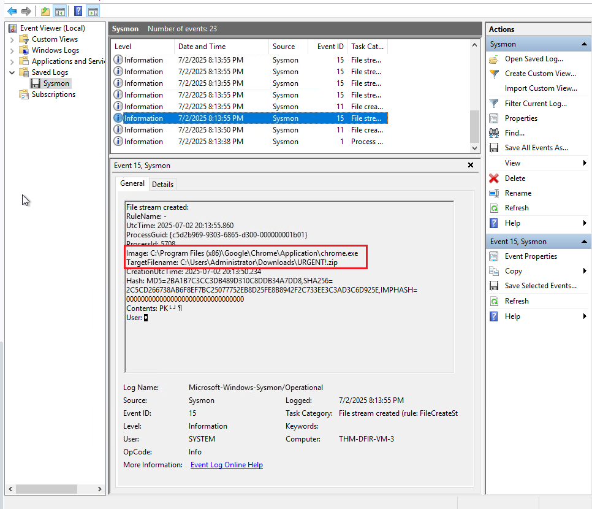

Further analysis identified the C2 malware executable as **`update.exe`**, located in the following directory:

```plaintext
C:\Users\Administrator\AppData\Roaming\update.exe
```

The use of a generic filename such as `update.exe` and its placement within the user's `AppData\Roaming` directory were considered relevant indicators for further investigation.

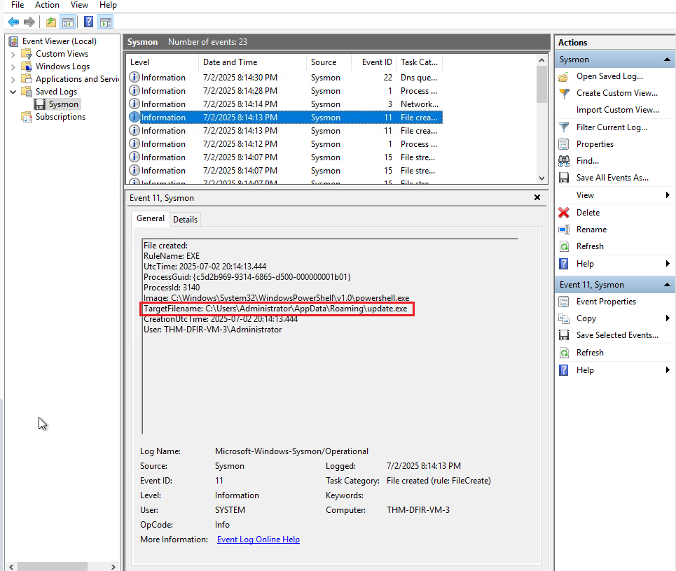

Network-related Sysmon events were then examined to identify external communication associated with the suspicious executable. The analysis identified the following domain:

```plaintext
route.m365officesync.workers.dev
```

The relationship between the malicious executable and this external domain provided evidence consistent with a C2 communication channel.

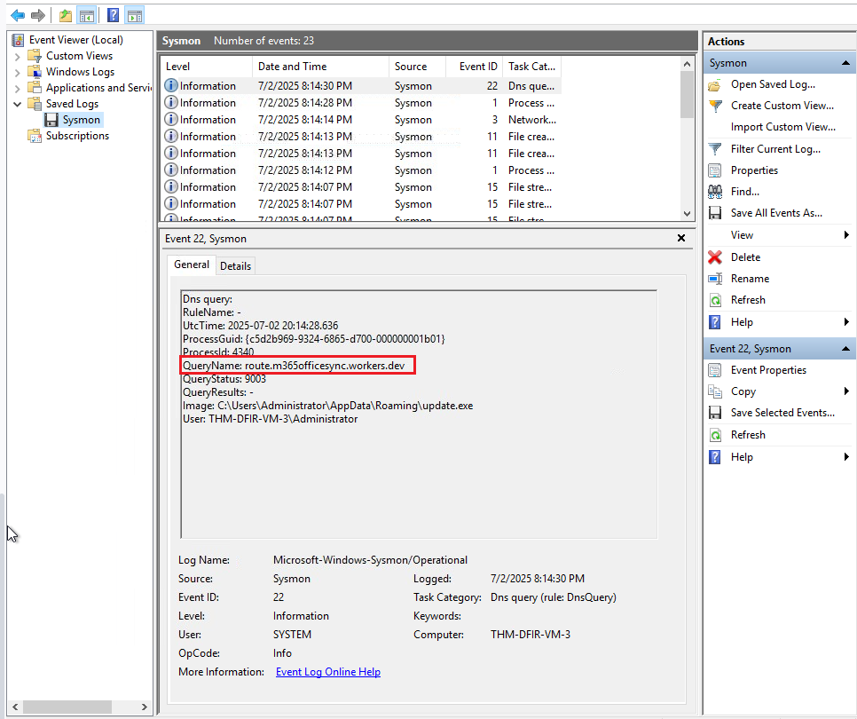

The resulting C2 activity can therefore be summarized as:

```text
URGENT!.zip
     ↓
update.exe
     ↓
C:\Users\Administrator\AppData\Roaming\update.exe
     ↓
route.m365officesync.workers.dev
```

---

## 3.2. Persistence via Backdoored User Account

The investigation then moved to the Windows Security logs to determine whether the threat actor had established an additional account for persistent access.

The analysis focused on:

```plaintext
C:\Users\Administrator\Desktop\Practice\Task 3\Security.evtx
```

Initial authentication events revealed **six failed login attempts** against the `Administrator` account before a successful authentication was observed. This activity was relevant because repeated failed authentication attempts followed by a successful login can indicate an attempt to gain access to a privileged account.

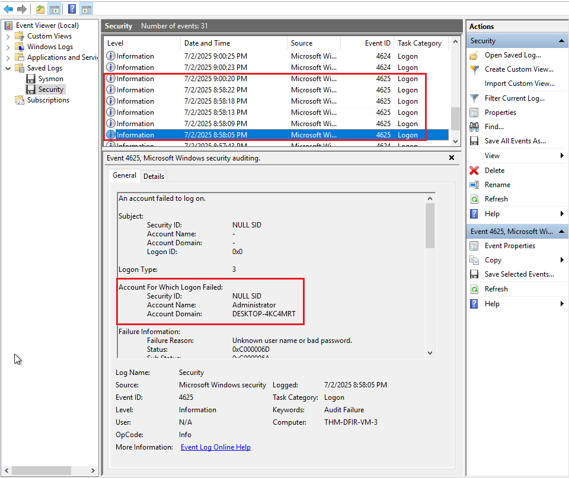

Following the successful authentication, a new local user account named **`support`** was created. The account creation was recorded in the Windows Security logs and provided evidence of a new identity being established on the compromised host.

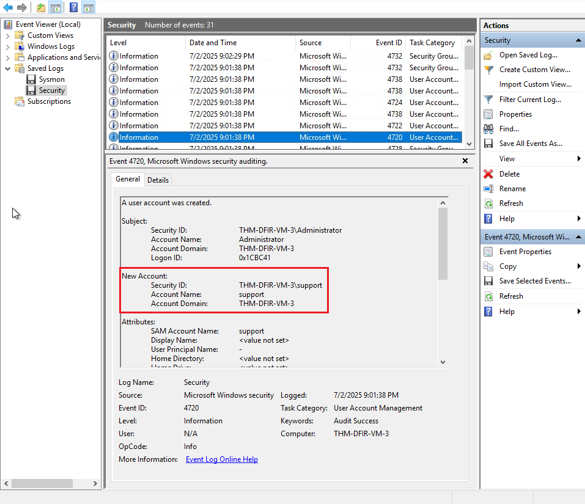

Further analysis revealed that the newly created `support` account was subsequently added to the **`Administrators`** group. This granted the account elevated privileges on the Windows host and significantly increased its ability to maintain access and perform privileged actions.

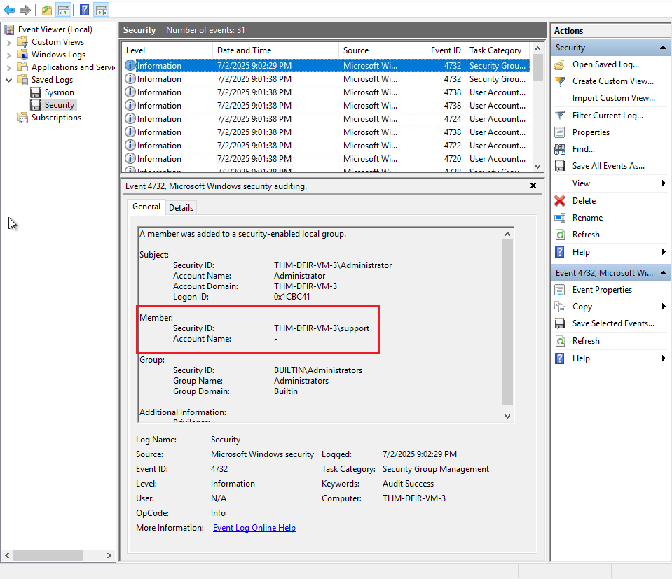

The sequence of events established a clear relationship between the authentication activity and the creation of a privileged account:

```text
Failed Administrator Logons
          ↓
Successful Authentication
          ↓
support Account Created
          ↓
support Added to Administrators
          ↓
Privileged Persistent Access
```

This activity provided evidence of a persistence mechanism based on the creation of a new privileged user account. The combination of the account creation and subsequent administrative group membership made the `support` account an important artifact for detection and incident response.

---

## 3.3. Persistence via Windows Services and Scheduled Tasks

The investigation continued by examining additional persistence mechanisms involving Windows services and scheduled tasks.

The analysis focused on the artifacts available in:

```plaintext
C:\Users\Administrator\Desktop\Practice\Task 4\
```

Two separate persistence mechanisms were identified during the investigation.

The first mechanism involved a Windows service created to maintain persistence for the **Nessie** malware. The service was identified as:

```plaintext
Data Protection Service
```

The creation of a new Windows service provided the malware with a mechanism to execute through the operating system's service infrastructure, allowing the malicious component to remain available beyond the initial compromise.

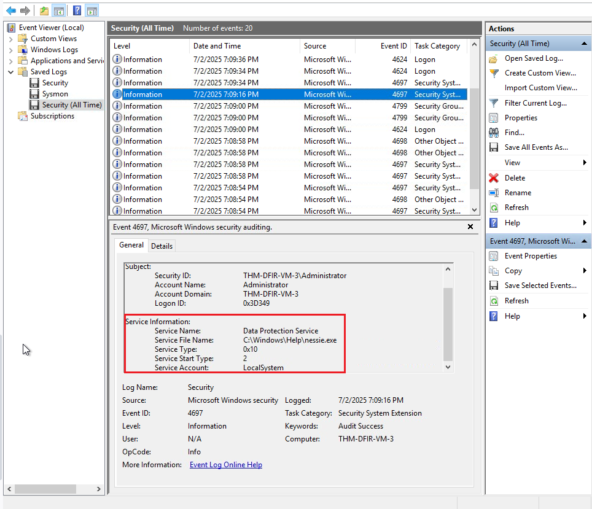

The investigation then examined scheduled task activity associated with the **Troy** malware. A scheduled task named:

```plaintext
AmazonSync
```

was identified as another persistence mechanism.

Scheduled tasks can allow malicious programs to execute automatically according to a configured trigger, providing an additional method for maintaining access to a compromised Windows host.

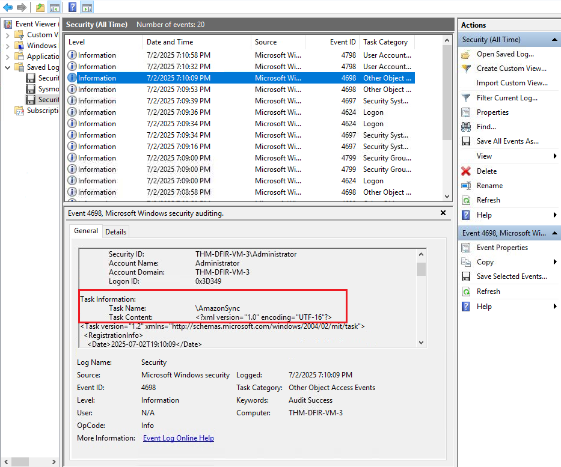


The associated `troy.exe` executable was subsequently located and executed from the command line in the controlled lab environment to validate the identified artifact.

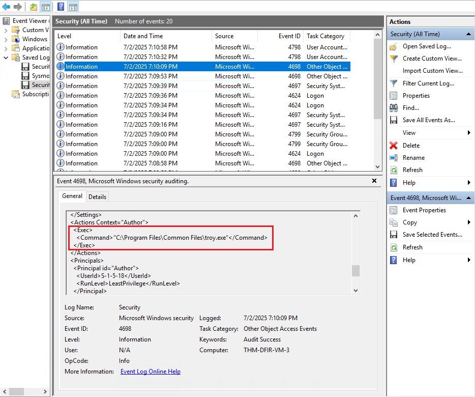


A second execution capture was used to document the resulting behavior. The challenge-specific output has been intentionally omitted from this report.

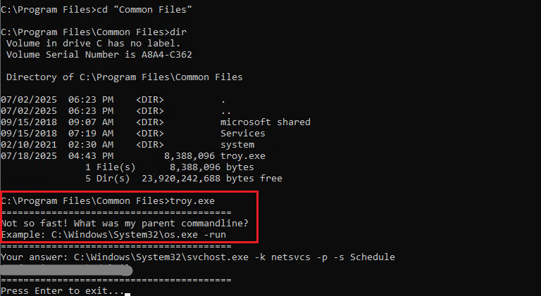


The persistence mechanisms identified in this stage can be summarized as:

```text
Nessie
  ↓
Data Protection Service
  ↓
Windows Service Persistence


Troy
  ↓
AmazonSync
  ↓
Scheduled Task Persistence
```

The identification of multiple independent persistence mechanisms demonstrates how a threat actor can establish redundant methods of maintaining access to a compromised Windows host. Detecting service creation and scheduled task activity is therefore an important component of post-compromise Windows monitoring.

---

## 3.4. Persistence via Run Keys and Startup

The investigation then examined persistence mechanisms associated with Windows user logon activity, focusing on artifacts that could allow malicious programs to execute when a user logs into the system.

The analysis focused on the artifacts available in:

```plaintext
C:\Users\Administrator\Desktop\Practice\Task 5\
```

The first artifact investigated was the **Odin** executable. Sysmon process creation evidence was examined to identify the parent process associated with its execution.

The analysis identified:

```plaintext
C:\Windows\explorer.exe
```

as the parent process of Odin.

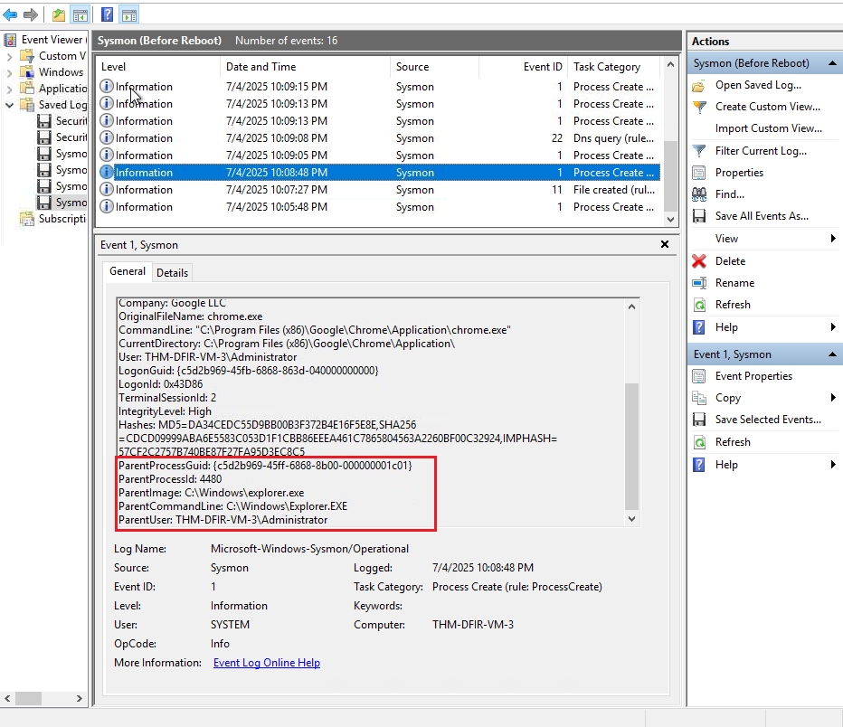

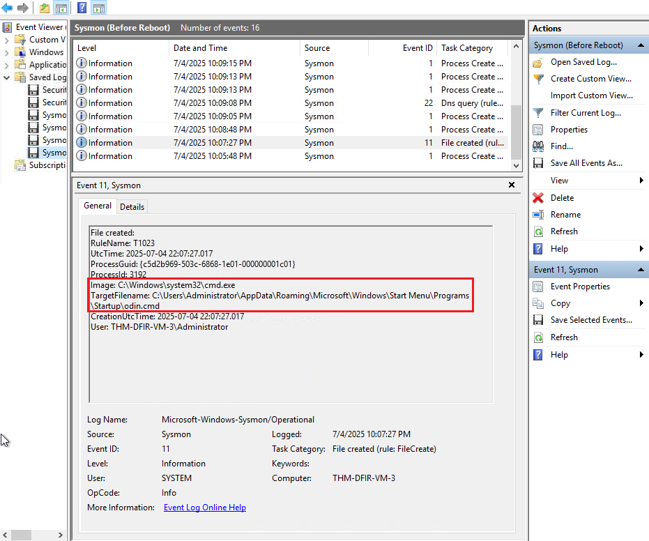


The relationship between `explorer.exe` and the Odin process was considered relevant when investigating user-logon persistence. Processes launched through mechanisms associated with user logon can inherit `explorer.exe` as their parent process, making process creation telemetry useful for identifying suspicious execution.

The Odin executable was subsequently executed in the controlled lab environment to validate the identified artifact. The program produced the following output:

```text
Done doing bad stuff!
```

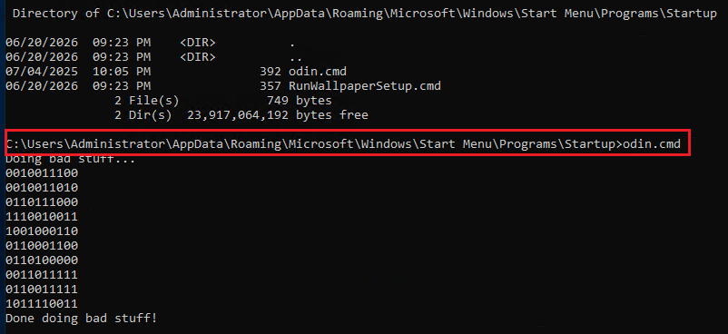


The investigation then identified another suspicious artifact associated with the **Kitten** malware. Event Viewer evidence was used to locate the executable before it was manually executed in the controlled environment.

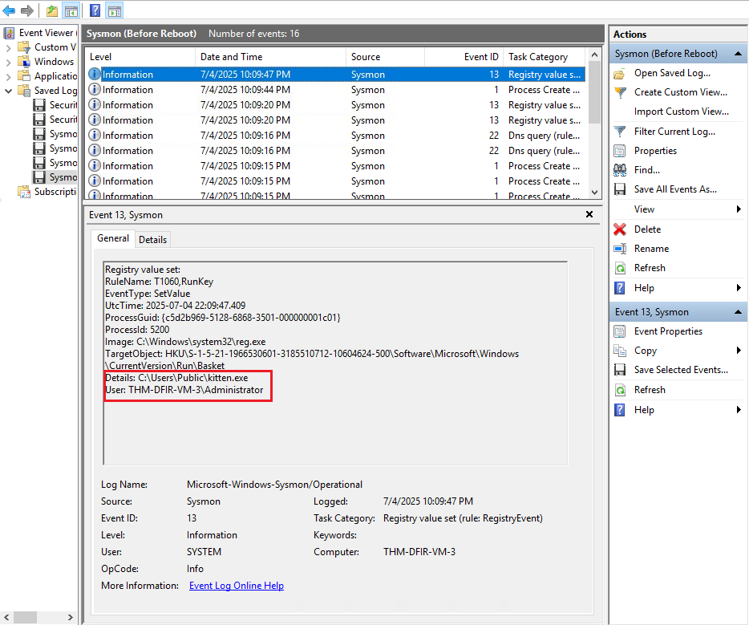


The identified Kitten executable was subsequently executed from the command line to validate the artifact and observe its behavior. The challenge-specific output has been intentionally omitted from this report.

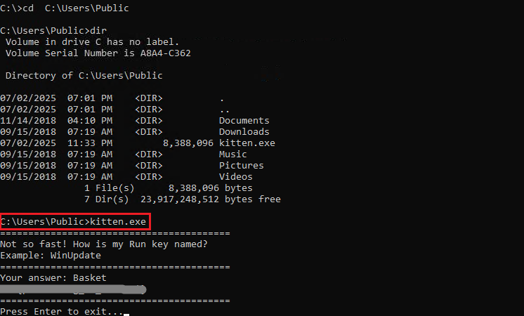


The user-logon persistence investigation can therefore be summarized as:

```text
User Logon Activity
        ↓
explorer.exe
        ↓
 Odin
        ↓
Suspicious Execution


Event Viewer Evidence
        ↓
Kitten Executable Located
        ↓
Controlled Execution
```

These findings demonstrate the importance of correlating process creation and user-logon activity when investigating persistence on Windows systems. A suspicious process launched in the context of a user session may provide valuable evidence when combined with additional telemetry such as Sysmon process creation events, file creation events and registry activity.

---

# 4. Indicators of Compromise (IOCs)

The investigation identified several artifacts that can be used as Indicators of Compromise (IOCs) for detecting similar activity on Windows systems.

The identified indicators are summarized below.

| Category | Indicator | Context |
|---|---|---|
| File | `URGENT!.zip` | Suspicious archive downloaded during the initial compromise |
| File | `C:\Users\Administrator\AppData\Roaming\update.exe` | C2 malware executable identified on the compromised host |
| Domain | `route.m365officesync.workers.dev` | External domain associated with network activity from the suspicious executable |
| User Account | `support` | Unauthorized account created after successful authentication |
| Privileged Group | `Administrators` | Group to which the `support` account was added |
| Windows Service | `Data Protection Service` | Service created to maintain persistence for Nessie |
| Scheduled Task | `AmazonSync` | Scheduled task created to maintain persistence for Troy |
| Process | `Odin` | Suspicious executable investigated in relation to user-logon activity |
| Process | `Kitten` | Suspicious executable identified and validated through controlled execution |

These indicators should be considered together with their associated timestamps, process relationships, authentication events and network activity rather than treated as isolated artifacts.

Particular attention should be given to the combination of suspicious executables, unexpected account creation, privilege escalation, service creation, scheduled task creation and external network communication. Correlating these artifacts can provide stronger evidence of compromise than any single indicator in isolation.

The following IOC categories were identified during the investigation:

```text
Files
 ├── URGENT!.zip
 └── update.exe

Network
 └── route.m365officesync.workers.dev

Account
 └── support
       ↓
   Administrators

Persistence
 ├── Data Protection Service
 └── AmazonSync

Suspicious Processes
 ├── Odin
 └── Kitten
```

These indicators provide a practical starting point for detection rules, threat hunting and retrospective analysis of Windows telemetry in environments where similar post-compromise activity may occur.

---

# 5. Findings

The investigation reconstructed a sequence of post-compromise activity across the Windows host by correlating Sysmon and Windows Security telemetry.

The analysis identified evidence consistent with the following attack progression:

```text
Initial Compromise
       ↓
C2 Component Deployment
       ↓
External C2 Communication
       ↓
Administrator Authentication Attempts
       ↓
Support Account Creation
       ↓
Administrative Privilege Assignment
       ↓
Multiple Persistence Mechanisms
       ↓
Potential Continued Access
```

The investigation identified a suspicious archive named `URGENT!.zip`, followed by the presence of the `update.exe` executable within the user's `AppData\Roaming` directory. Network telemetry subsequently identified communication involving `route.m365officesync.workers.dev`. Together, these artifacts were consistent with the establishment of a C2 mechanism on the compromised host.

Authentication telemetry then showed six failed login attempts against the `Administrator` account before successful authentication. Following this activity, the `support` account was created and subsequently added to the `Administrators` group, providing the newly created account with elevated privileges.

Additional persistence mechanisms were identified through Windows services and scheduled tasks. The `Data Protection Service` was associated with the Nessie malware, while the `AmazonSync` scheduled task was associated with the Troy malware.

The investigation also examined suspicious activity associated with user-logon execution. Odin was identified with `C:\Windows\explorer.exe` as its parent process, while the Kitten executable was located through Event Viewer evidence and subsequently validated through controlled execution.

---

## 5.1. Key Findings

- **C2 infrastructure was identified:** the `update.exe` executable and `route.m365officesync.workers.dev` domain were associated with network activity consistent with command and control communication.

- **Suspicious authentication activity was observed:** six failed login attempts against the `Administrator` account occurred before successful authentication.

- **A backdoor user account was created:** the `support` account was created following the successful authentication activity.

- **The backdoor account received administrative privileges:** the `support` account was added to the `Administrators` group, providing elevated access to the compromised host.

- **Multiple persistence mechanisms were established:** the investigation identified both the `Data Protection Service` and the `AmazonSync` scheduled task as persistence mechanisms associated with separate malware artifacts.

- **User-logon execution provided additional detection opportunities:** Odin was observed with `C:\Windows\explorer.exe` as its parent process, while Kitten was identified through Event Viewer evidence and validated through controlled execution.

Overall, the investigation demonstrated that the compromise could be reconstructed by correlating authentication, account management, process creation, network communication, service creation, scheduled task activity and user-logon artifacts.

From a SOC perspective, the findings highlight the importance of correlating multiple Windows telemetry sources rather than investigating individual events in isolation. The relationship between otherwise separate events provided a clearer picture of the post-compromise activity and the mechanisms used to maintain access to the host.

---

# 6. Mitigation Recommendations

Based on the findings identified during the investigation, several defensive measures can be implemented to reduce the likelihood and impact of similar activity on Windows systems.

---

## 6.1. Strengthen Authentication Controls

Repeated failed authentication attempts against privileged accounts should be monitored and investigated.

Recommended measures include:

- Enable Multi-Factor Authentication (MFA) where supported.
- Implement account lockout or throttling policies appropriate to the environment.
- Monitor repeated failed logon attempts against privileged accounts.
- Restrict the use of shared or generic administrative accounts.
- Apply strong password policies and prevent password reuse.
- Review privileged account activity regularly.

Particular attention should be given to sequences involving multiple failed authentication attempts followed by a successful login.

---

## 6.2. Monitor Privileged Account Creation

The creation of unexpected local accounts should generate an alert or investigation workflow.

Security teams should monitor for:

- Creation of new local user accounts.
- Unexpected additions to privileged groups such as `Administrators`.
- Changes to existing account privileges.
- Account creation outside approved administrative procedures.

Accounts that are not associated with a documented administrative requirement should be investigated and disabled or removed according to incident response procedures.

---

## 6.3. Monitor Windows Service and Scheduled Task Creation

Windows services and scheduled tasks can provide legitimate administrative functionality but can also be abused for persistence.

Detection rules should monitor:

- Creation of new Windows services.
- Creation or modification of scheduled tasks.
- Execution of `sc.exe` and `schtasks.exe`.
- Services or scheduled tasks launching executables from unusual locations.
- Unexpected services or tasks created by non-administrative processes.

New persistence mechanisms should be validated against known administrative changes and software deployment activity.

---

## 6.4. Monitor Suspicious Process and File Activity

Endpoint telemetry should be used to identify suspicious executables and unusual execution locations.

Recommended monitoring includes:

- Process creation involving executables from user-writable directories.
- Executables launched from `AppData` or other unusual locations.
- Suspicious parent-child process relationships.
- Newly created or downloaded executable files.
- Execution of binaries with generic or misleading filenames.

Sysmon process creation and file creation events can provide useful telemetry for this type of investigation.

---

## 6.5. Monitor Network Connections to Suspicious Infrastructure

Outbound network connections from unexpected processes should be investigated, particularly when the destination is unfamiliar or newly observed.

Recommended controls include:

- Monitor outbound connections from unusual processes.
- Investigate suspicious or newly observed domains.
- Use DNS logging to support domain-based threat hunting.
- Apply network filtering and egress controls where appropriate.
- Correlate process execution with outbound network connections.

A process such as `update.exe` communicating with an unexpected external domain should be investigated in the context of the surrounding host activity.

---

## 6.6. Centralize and Correlate Windows Telemetry

The investigation demonstrated the value of correlating multiple Windows event sources.

A centralized SIEM or equivalent monitoring platform should collect and correlate:

```text
Windows Security Logs
        +
Sysmon Logs
        +
DNS / Network Telemetry
        +
Endpoint Detection Data
        ↓
Centralized Detection & Correlation
```

Correlation rules can help identify sequences such as:

```text
Failed Logons
      ↓
Successful Authentication
      ↓
New User Creation
      ↓
Administrative Group Membership
      ↓
Service / Scheduled Task Creation
      ↓
Suspicious Process Execution
      ↓
External Network Communication
```

Detecting these relationships can provide stronger evidence of compromise than monitoring each event independently.

---

## 6.7. Apply the Principle of Least Privilege

Administrative privileges should be limited to accounts and processes that require them.

Organizations should:

- Minimize the number of permanent local administrators.
- Use separate accounts for administrative and standard activities.
- Review local group membership regularly.
- Remove unnecessary administrative privileges.
- Apply least-privilege principles to services and scheduled tasks.

Reducing unnecessary privileges can limit the actions available to an attacker after an account is compromised.

---

## 6.8. Maintain Endpoint and Recovery Controls

Endpoint protection and recovery capabilities should complement detection controls.

Recommended measures include:

- Keep Windows and installed software patched.
- Maintain up-to-date endpoint protection.
- Enable tamper protection where available.
- Maintain offline or otherwise protected backups.
- Regularly test backup restoration procedures.
- Establish an incident response process for compromised endpoints.

These controls can help reduce both the likelihood of successful persistence and the potential impact of destructive activity such as ransomware.

---

## 6.9. Mitigation Summary

The investigation indicates that effective defense against this type of activity requires multiple layers of protection rather than a single security control.

```text
Authentication Controls
        ↓
Account & Privilege Monitoring
        ↓
Endpoint Detection
        ↓
Persistence Monitoring
        ↓
Network Monitoring
        ↓
Centralized Log Correlation
        ↓
Incident Response & Recovery
```

Implementing these controls can improve the ability of a SOC to detect suspicious post-compromise activity, investigate related artifacts and contain affected systems before the attacker can progress further.
